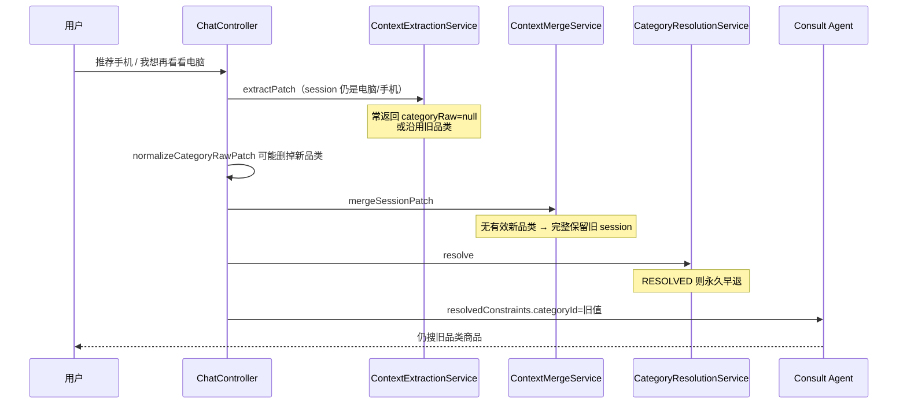
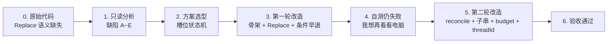
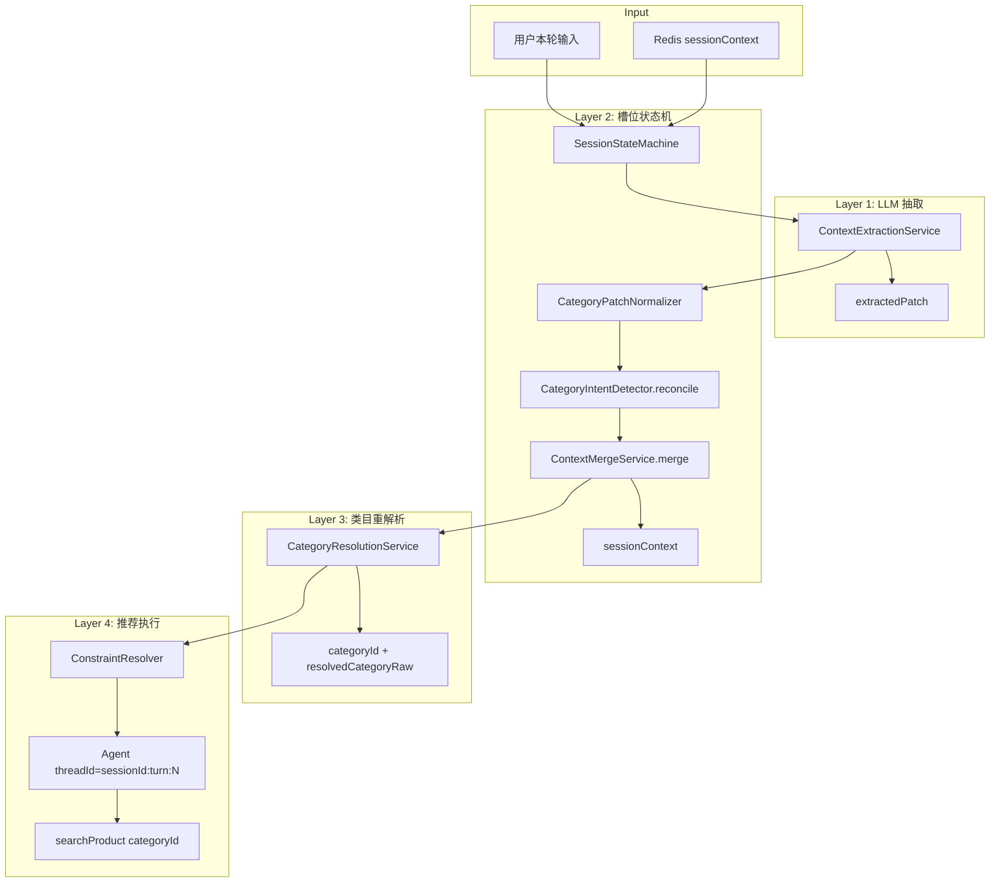

# 品类槽位状态机改造文档（完整历程）

> 本文从 **改造前原始代码（一次都未动过）** 写起，记录问题如何发现、如何分析、分几轮改造、每轮改了什么、为何第一轮仍不够、最终如何收敛。  
> 目标问题：多轮对话中用户已换品类，系统仍按旧品类推荐。  
> 最终架构原则：**LLM 抽取 + 后端槽位状态机（品类 Replace）+ 类目重解析 + 工具层只认最新 categoryId**。

---

## 0. 改造前基线（完全未改时的系统）

在动手改任何代码之前，项目 **已经具备** 一套导购上下文管道（见 `docs/EVOLUTION.md` 阶段 B~D），并不是「全靠大模型记聊天记录」。但 **品类切换** 这一块的语义不完整，导致多轮换品类失败。

### 0.1 改造前的模块分工

| 模块 | 职责 |
|------|------|
| `ChatController.prepareContext()` | 单方法内串联整条上下文管道 |
| `ContextExtractionService` | LLM 从用户话里抽 JSON patch（`categoryRaw`、budget、scene…） |
| `ContextMergeService` | 把 patch 合并进 Redis 里的 `sessionContext` |
| `CategoryResolutionService` | 调 catalog `/normalize`，把 `categoryRaw` → `categoryId` |
| `ConstraintResolver` | 生成 Agent 用的 `resolvedConstraints`（会话优先于画像） |
| `SessionStoreService` | Redis 持久化 `sessionContext` + `turns` |
| Consult Agent | 只读 `resolvedConstraints`，`searchProduct` 优先传 `categoryId` |

### 0.2 改造前单轮流程（`ChatController.prepareContext`）

```
1. SessionStoreService.getSession()           → 读出上轮 sessionContext
2. ContextExtractionService.extractPatch()    → LLM 抽 patch
   （若有 pendingField → extractPendingFieldPatch）
3. normalizeCategoryRawPatch()                → 写在 ChatController 里的清洗逻辑
4. ContextMergeService.mergeSessionPatch()    → 合并进 session
5. applyPendingFieldResult / applyCategoryConfirmation
6. CategoryResolutionService.resolve()        → 写 categoryId
7. ContextMergeService.buildEffectiveContext() → resolvedConstraints
8. Agent 推荐（threadId = sessionId）
```

**当时的设计意图是对的**：结构化状态在 Redis，LLM 只抽取，Agent 只认 `categoryId`。  
**缺的是**：「用户换品类」时，没有明确的 **Replace 语义** 和可靠的 **纠偏机制**。

### 0.3 改造前 sessionContext 里有什么

主要字段（`Map<String, Object>`，无强类型）：

- `categoryRaw` / `categoryId` / `categoryName` / `categoryConfidence` / `categoryResolution`
- `budget` / `scene` / `brandPreferences` / `dislikes` / `mustHave`
- `pendingField` / `askedFields` / `intentType` / `userUncertain`

**没有** `resolvedCategoryRaw`、`categorySource`、`categoryUpdatedAt` 等用于「解析是否仍有效」的元数据。

### 0.4 用户最初反馈的现象

| 场景 | 用户操作 | 期望 | 实际 |
|------|----------|------|------|
| 简单换品类 | 第 1 轮「推荐电脑」→ 第 2 轮「推荐手机」 | 推手机 | **仍推电脑** |
| 带预算与追问 | 「买手机预算3000」→「先看看」→「我想再看看电脑」 | 推电脑 | **仍推手机**，且话术里仍写「预算3000内的手机」 |

说明：**不是前端 sessionId 丢了**（`ChatView.vue` 会复用同一 session），而是 **服务端 `sessionContext` 里的 `categoryId` 没有被新一轮用户意图覆盖**。

---

## 1. 改造前根因分析（只读代码、尚未改一行）

对原始代码做静态分析后，定位到 **五条缺陷**（可叠加生效）：



### 缺陷 A：合并没有「品类 Replace」

`ContextMergeService.mergeSessionPatch()` 核心逻辑：

```java
Map merged = new HashMap<>(isCategoryChanged(current, patch) ? Map.of() : current);
```

`isCategoryChanged` 要求 patch **里必须有新 categoryRaw**。LLM 若返回 `null`，合并从 **完整旧 current** 开始，**`categoryId` 原样保留**。

### 缺陷 B：`CategoryResolutionService` 早退锁死

```java
if (categoryResolution == RESOLVED && categoryId != null) {
    return 旧 categoryId;  // 不检查 categoryRaw 是否已变
}
```

上一轮一旦解析成功，后续轮次 **永不重解析**。

### 缺陷 C：`normalizeCategoryRawPatch` 误删新品类

写在 `ChatController` 中：若 LLM 抽「智能手机」而用户说「推荐手机」，因字面不包含而被 **remove categoryRaw**；或与当前品类字符串不一致时也会删。换品类 patch 被主动删掉。

### 缺陷 D：没有可靠的规则纠偏

改造前 **不存在** `CategoryIntentDetector` 等模块；完全依赖 LLM patch。LLM 不稳定时无兜底。

### 缺陷 E：Agent `threadId = sessionId`

多轮共用 LangGraph checkpoint，可能加剧「像没换品类」的体感（与 A~D 叠加）。

### 1.1 当时为何「看起来更依赖大模型」

- `turns` 只存展示用，**不参与**合并与推荐
- 真正决定推荐品类的是 `sessionContext.categoryId`
- 但合并与解析规则有洞 → **等价于「换品类时状态机失效」**，表现就像「系统还记着上一轮品类」

---

## 2. 方案选型（改造前讨论，尚未写代码）

在改代码之前，先对齐了业界常见做法，而不是赌 prompt：

| 做法 | 结论 |
|------|------|
| 只靠加长 Agent prompt | 不行；上游 `categoryId` 错了，下游必错 |
| 只靠时间戳 | 辅助手段，不能替代 Replace 语义 |
| **LLM 抽取 + 槽位状态机 + 派生字段失效 + 工具认 categoryId** | **采用** |

槽位策略约定：

- `category` → **Replace**
- `categoryId` 等 → **派生字段**，随 `categoryRaw` 变化而清空并重算
- `budget` → 待定（后文有两轮不同取舍）
- `scene` / `mustHave` → 换品类时清空

---

## 3. 第一轮改造（核心骨架，尚未完全解决问题）

应你的要求开始写代码（当时约定先不写测试，由你自测）。第一轮主要落地「槽位 Replace + 解析条件早退 + 编排收敛」。

### 3.1 第一轮新增模块

| 文件 | 职责 |
|------|------|
| `SessionStateMachine` | 从 `ChatController.prepareContext` 抽出的编排入口 |
| `CategoryPatchNormalizer` | 替代 Controller 内 `normalizeCategoryRawPatch` 的有害部分 |
| `CategoryIntentDetector` | 规则兜底，当时为 **`fillIfMissing`**（仅 patch 无 categoryRaw 时） |
| `CategoryEquivalenceChecker` | 判断两品类是否同一类目 |
| `SessionContextKeys` / `SessionContextSupport` | 字段常量与工具 |
| `MergeSessionResult` / `SessionProcessResult` | 合并与处理结果 DTO |

### 3.2 第一轮重点修改

| 文件 | 改动 |
|------|------|
| `ContextMergeService` | `shouldReplaceCategory` + 换品类时清空派生字段 / scene / mustHave / pending |
| `CategoryResolutionService` | 新增 `resolvedCategoryRaw`；仅 raw 未变才早退 |
| `ContextExtractionService` | prompt 增加「换品类必须输出 categoryRaw」 |
| `ChatController` | 委托 `SessionStateMachine`；移除误删逻辑；增加 `stateDebug` |

### 3.3 第一轮合并策略（当时）

- 换品类时 **不继承旧 budget**（与前一版描述不同，**已修正**）
- 换品类时清空 scene / mustHave
- `CategoryIntentDetector.fillIfMissing`：只有 patch 里没有 `categoryRaw` 才调 catalog normalize

### 3.4 第一轮改造后的流程

```
extractPatch → CategoryPatchNormalizer → fillIfMissing（仅缺失时）
→ mergeSessionPatch（Replace）→ resolve（条件早退）→ Agent
```

### 3.5 第一轮自测结果：**仍有问题**

你反馈并提供了截图：路径「买手机预算3000 → 先看看 → **我想再看看电脑**」仍推荐手机。

说明：**骨架对了，但边界 case 未盖住**。问题不在「没做 Replace」，而在 **新品类经常进不了 patch**。

---

## 4. 第一轮为何不够（回归「我想再看看电脑」）

针对你截图中的失败路径，第二轮排查结论如下：

| # | 原因 | 说明 |
|---|------|------|
| 1 | **LLM 把旧品类写回 patch** | session 是手机时，LLM 可能仍返回 `categoryRaw: "手机"`。`fillIfMissing` **看到 patch 已有值就跳过**，Replace 不触发 |
| 2 | **规则只整句 normalize** | 「我想再看看电脑」整句 normalize 在部分情况下不如子串「电脑」稳 |
| 3 | **旧 budget 污染话术** | 换到电脑仍带「手机 3000」预算，回复里仍出现「3000元内的手机」 |
| 4 | **Agent threadId 未隔离** | 多轮共用 `sessionId`，Agent 图状态可能延续上一轮手机推荐语境 |
| 5 | **pendingField=scene 的追问路径** | 第 2 轮「先看看」走 pending 抽取；第 3 轮换品类对抽取要求更高，更易漏 `categoryRaw` |

**关键认知**：仅有「patch 为空才兜底」在真实对话里 **不够**；必须 **用用户消息纠偏 patch，即使用户消息与 LLM 结论冲突**。

---

## 5. 第二轮改造（补齐后才真正生效）

在你反馈「还是不行」后，做了以下 **增量** 修改（在第一轮骨架之上）：

### 5.1 `fillIfMissing` → `reconcileCategoryPatch`

```java
// 第一轮：patch 有 categoryRaw 就不动
if (patch.has categoryRaw) return;

// 第二轮：始终从用户消息检测；与 session 不同则强制覆盖 patch
detectCategoryRaw(userMessage, session).ifPresent(detected -> {
    patch.put("categoryRaw", detected);
    patch.put("categorySource", "rule");
});
```

即使 LLM 写了错的「手机」，规则层也可改成「电脑」。

### 5.2 子串扫描 normalize

对 userMessage 做长度 2~8 的子串扫描，分别调 catalog normalize。  
例如从「我想再看看电脑」抽出 **「电脑」** → `cat_computer`，不依赖整句命中。

### 5.3 换品类时默认 **不继承 budget**

第一轮：换品类保留 budget。  
第二轮：**换品类且本轮未提新预算 → 清空 budget**，避免「手机 3000」绑在电脑上。

### 5.4 每轮独立 Agent `threadId`

```java
// 改造前
.threadId(sessionId)

// 第二轮
.threadId(sessionId + ":turn:" + turnCount)
```

Redis 会话仍用同一 `sessionId`；仅 Agent 图状态按轮隔离。

### 5.5 Agent prompt 补强

增加：若 `userMessage` 明确换品类，必须以 `resolvedConstraints` 最新 `categoryId` 重新 `searchProduct`。

### 5.6 第二轮自测结果

你确认：**终于改好了**。

---

## 6. 完整时间线总览



| 阶段 | 代码状态 | 结果 |
|------|----------|------|
| **0. 基线** | 未改任何文件 | 换品类失败 |
| **3. 第一轮** | 新增状态机、Replace、resolvedCategoryRaw、fillIfMissing | 简单「电脑→手机」可能好转；**复杂路径仍失败** |
| **5. 第二轮** | reconcile、子串、budget 清空、threadId 隔离 | **你验证通过** |

---

## 7. 最终架构（当前代码）



---

## 8. 最终槽位合并策略

| 槽位 | 策略 | 换品类时 |
|------|------|----------|
| `categoryRaw` | REPLACE | 写入新品类 |
| `categoryId` / `categoryName` / `categoryConfidence` / `categoryResolution` / `resolvedCategoryRaw` | DERIVED | 清空后重解析 |
| `budget` | 不继承（第二轮起） | 清空，除非本轮 patch 带新 budget |
| `scene` / `mustHave` | CLEAR | 清空 |
| `brandPreferences` / `dislikes` | KEEP | 保留 |
| `pendingField` | CLEAR | 清空 |

---

## 9. 最终单轮流程示例

用户：**「我想再看看电脑」**（session 当前为手机 + budget 3000）

```
1. getSession → categoryId=cat_phone, budget=3000
2. extractPatch → 可能 null 或错误「手机」
3. CategoryPatchNormalizer → 清洗字段，不删新品类
4. reconcileCategoryPatch → 子串「电脑」→ 强制 patch.categoryRaw=电脑
5. mergeSessionPatch → categoryReplaced=true，清 budget/scene/派生字段
6. resolve → cat_computer，写 resolvedCategoryRaw=电脑
7. resolvedConstraints.categoryId=cat_computer
8. Agent（threadId=sessionId:turn:4）→ searchProduct(cat_computer)
9. appendTurns → Redis 持久化新 session
```

---

## 10. 核心代码逻辑（最终版）

### 10.1 品类 Replace（`ContextMergeService`）

```java
boolean categoryReplace = shouldReplaceCategory(current, patch);
if (categoryReplace) {
    preserveFieldsOnCategoryReplace(merged, current);  // 不含 budget
    applyCategoryReplaceSideEffects(merged);
} else {
    merged.putAll(current);
}
copyIfPresent(merged, patch, "categoryRaw");
```

### 10.2 条件早退（`CategoryResolutionService`）

```java
if (RESOLVED && categoryId != null
    && resolvedCategoryRaw != null
    && currentRaw.equalsIgnoreCase(resolvedCategoryRaw)) {
    return 复用;
}
// 否则重新 normalize，并更新 resolvedCategoryRaw
```

### 10.3 强制 reconcile（`CategoryIntentDetector`）

1. 整句 normalize  
2. 子串 2~8 字 normalize  
3. 与 session 不同 → **覆盖** patch（不問 LLM 填了什么）

### 10.4 threadId 隔离（`ChatController`）

```java
.threadId(prepared.sessionId() + ":turn:" + turnCount)
```

---

## 11. sessionContext 字段（最终）

| 字段 | 说明 |
|------|------|
| `categoryRaw` | 用户品类原词 |
| `categoryId` | catalog 归一化 ID |
| `resolvedCategoryRaw` | 当前 categoryId 对应的 raw（早退判断） |
| `categorySource` | `llm` / `rule` |
| `categoryUpdatedAt` | 品类变更时间 |
| `budget` / `scene` / `pendingField` | 见 §8 |

---

## 12. 调试：stateDebug

SSE `done.debug.stateDebug` 示例：

```json
{
  "categoryReplaced": true,
  "categoryReplaceReason": "category_raw_changed:手机->电脑",
  "sessionContextBefore": { "categoryId": "cat_phone" },
  "sessionContextAfter": { "categoryId": "cat_computer", "resolvedCategoryRaw": "电脑" },
  "resolvedConstraints": { "categoryId": "cat_computer" }
}
```

---

## 13. 三阶段对比总表

| 维度 | 0. 改造前 | 3. 第一轮后 | 5. 第二轮后（最终） |
|------|-----------|-------------|---------------------|
| 品类 Replace | 无 | 有 | 有 |
| 解析早退 | 永久锁死 | 条件早退 | 条件早退 |
| 规则兜底 | 无 | fillIfMissing（仅空 patch） | **reconcile 强制覆盖** |
| 子串检测 | 无 | 无 | **有** |
| 换品类 budget | 继承 | 继承 | **默认清空** |
| threadId | sessionId | sessionId | **sessionId:turn:N** |
| 编排 | ChatController 内联 | SessionStateMachine | SessionStateMachine |
| 复杂换品类路径 | 失败 | **仍可能失败** | **你验证通过** |

---

## 14. 验收场景

| # | 场景 | 期望 |
|---|------|------|
| 1 | 推荐电脑 → 推荐手机 | `cat_phone`，推手机 |
| 2 | 买手机预算3000 → 先看看 → 我想再看看电脑 | `categoryReplaced=true`，推电脑 |
| 3 | 推荐电脑 → 5000 左右 | 仍电脑，只更新 budget |
| 4 | LLM 错写旧品类 + 用户说换手机 | reconcile 覆盖，仍切换 |

---

## 15. 相关文件索引

```
shopping-orchestrator/.../orchestrator/
├── controller/ChatController.java
├── service/
│   ├── SessionStateMachine.java
│   ├── ContextExtractionService.java
│   ├── ContextMergeService.java
│   ├── CategoryResolutionService.java
│   ├── CategoryIntentDetector.java      # 第二轮：reconcile + 子串
│   ├── CategoryPatchNormalizer.java
│   ├── CategoryEquivalenceChecker.java
│   └── CategoryClientService.java
├── support/SessionContextKeys.java, SessionContextSupport.java
└── dto/MergeSessionResult.java, SessionProcessResult.java, ChatPreparedContext.java
```

---

## 16. 总结

1. **改造前**：已有结构化 session + LLM 抽取 + categoryId 归一化，但 **缺品类 Replace 与纠偏**，换品类会锁死旧 `categoryId`。  
2. **第一轮**：补上状态机骨架与 Replace，方向对，但 **「LLM 写错旧品类 / 复杂句式」** 仍会漏。  
3. **第二轮**：`reconcile` 强制纠偏、子串 normalize、清空跨品类 budget、threadId 隔离，与你实测路径对齐后 **验收通过**。

本质不变：

> **品类是可替换槽位；LLM 负责抽，代码负责合并与失效；Agent 只认最新 `categoryId`。**

---

## 17. 第三轮改造（证据门控 + budget 修正）

第二轮验收后，又出现「手机 + 预算3000 + 场景追问 → 用户答学习 → 仍推电脑」的路径。根因是 **LLM 在追问抽取时幻觉写入旧 `categoryRaw`**，merge 未校验用户原话证据。

第三轮改动：

- 新增 `CategoryPatchGuard`：merge 前拦截无证据的 LLM 品类替换  
- `ContextMergeService`：换品类时不再继承旧 `budget`  
- 单元测试：`CategoryPatchGuardTest`、`ContextMergeServiceTest`

详见 **[CATEGORY_PATCH_GUARD.md](./CATEGORY_PATCH_GUARD.md)**。

---

## 18. 第四～五轮改造（记忆 + 品牌搜索）

第三轮（Guard）之后，继续落地：

- **记忆工程 P1**：分段 recall、session 去重 exclude、MemoryWriteFilter 写入门控  
- **品牌搜索分层兜底**：`ProductSearchFallback`、`BrandIntentDetector`、`searchHints`  
- **单测与配置**：orchestrator 8 个测试类、`recall-top-k` 等  

完整变更总览见 **[SESSION_MEMORY_SEARCH_REFACTOR.md](./SESSION_MEMORY_SEARCH_REFACTOR.md)**。

---

## 19. 后续可扩展（未做）

- 换品类时是否保留 budget 做成可配置策略  
- 类目列表缓存，减少子串 normalize 调用  
- `ProductReplyValidator`（防 Agent 编造库外商品）  
- Orchestrator 先搜后答  
- `sessionContext` 强类型化  
