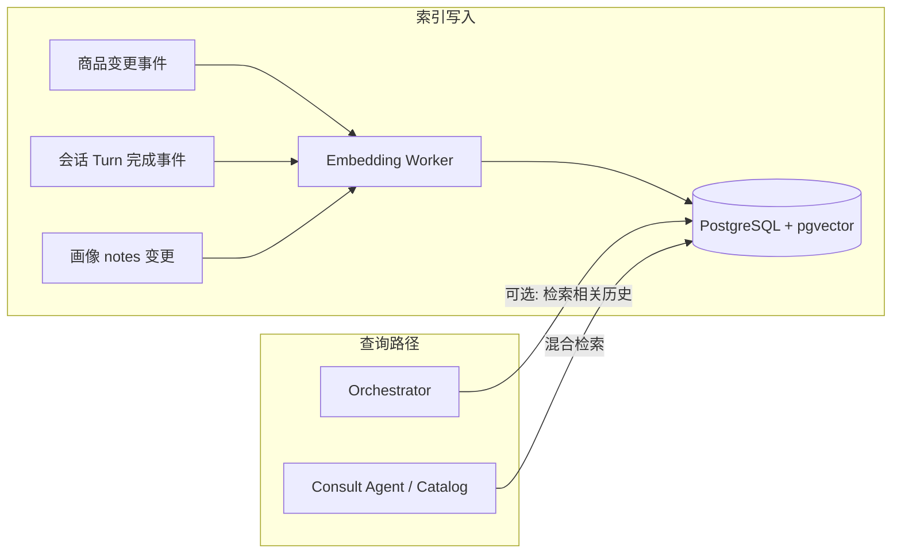

# Embedding 引入规划方案

本文档面向 **OnlineShoppingConsultant** 当前架构（Orchestrator + Consult Agent + MCP Catalog + Memory REST + Redis 会话），给出 **分阶段、可验收** 的 embedding 落地规划。默认读者为技术负责人，用于排期与评审。

---

## 1. 背景与现状

| 能力 | 现状 | 与 embedding 的关系 |
|------|------|---------------------|
| 商品检索 | 类目/关键词/SQL 或 MCP 工具侧逻辑 | 语义缺口明显，**向量化收益最大** |
| 会话 | Redis 短期、有限轮次 | 长对话**无「按语义召回」历史** |
| 长期画像 | MySQL 结构化 + notes 列表 + reconcile | 长文本/多条 notes **缺少语义检索** |
| 类目 | Catalog REST + 规则/评分匹配 | 仅在低置信场景**可做增强**，非首优先级 |

**结论**：embedding 应优先服务 **「可检索的文本块」**（商品描述、历史对话片段、自由文本偏好），而不是替代已有 **结构化约束链路**（`resolvedConstraints`、`categoryId`）。

---

## 2. 目标与非目标

### 2.1 目标（12～18 个月可分段达成）

1. **检索质量**：在相同类目与预算约束下，用户口语化需求能命中更合理的商品候选集。
2. **长对话体验**：多轮之后仍能「记起」与当前轮相关的早期表述，且不显著拖慢首 token。
3. **画像一致性**：合并/冲突处理时能拉取**语义相关**的历史 notes，而非全量拼接。
4. **可运维**：索引可重建、版本可追踪、成本可观测。

### 2.2 非目标（首期明确不做）

- 用向量检索**替代**类目归一与 `categoryId` 主路径。
- 用 embedding **替代** Orchestrator 的 JSON 抽取（除非后期有明确失败率数据支撑）。
- 自建大规模向量训练；默认采用 **商用/开源预训练 embedding API 或本地小模型**。

---

## 3. 设计原则

1. **结构化优先**：`categoryId`、预算区间、库存等仍走结构化过滤；向量用于 **召回 / 重排**，避免「向量一搜全站飘」。
2. **写入与查询分离**：商品、会话、画像的 **索引异步化**（消息队列或后台任务），查询路径设置超时与降级。
3. **同源可追溯**：每条向量记录携带 `source_type`、`source_id`、`embedding_model_version`、`content_hash`，便于重算与审计。
4. **隐私最小化**：写入索引前对文本做 **PII 脱敏策略**（规则 + 可选模型），会话索引按 `userId` 分区。

---

## 4. 总体架构（逻辑）



**推荐组件角色**（向量存储已定为 **pgvector**，见第 9 节）：

- **Embedding 服务**：统一对文本块生成向量（同步小批量 + 异步大批量）。
- **pgvector**：PostgreSQL 中存 `embedding vector(n)` + 标量列（过滤用）；用 SQL `WHERE` 做租户/类目裁剪，用 `<->` / `<=>` / `<#>` 做近邻排序。
- **业务服务**：Catalog 负责商品索引与检索 API；Orchestrator/Memory 负责会话与画像索引的触发与查询封装。

---

## 5. 分阶段路线图

### 阶段 A — 商品语义检索（P0，建议首期）

**业务价值**：直接提升「能买到、推得准」。

**范围**：

- 对 **商品可检索文本** 建索引：`title + 卖点/属性摘要 + 类目名`（字段以你们 `product` 表为准，避免整页 HTML）。
- 检索形态：**混合检索**  
  - 硬过滤：`categoryId`（若已解析）、价格区间、上架状态。  
  - 软排序：向量相似度 Top-K，再与关键词分数 **加权融合**（或两阶段：关键词粗排 → 向量精排）。

**接口形态（建议）**：

- Catalog 增加内部或对外 API：`searchHybrid(categoryId, budget, queryText, limit)`，内部调用向量检索 + 现有逻辑。
- MCP `searchProduct` 增加可选参数 `semanticQuery`（默认等于用户原话），由 Consult Agent 传入，避免改 orchestrator 契约过大。

**验收指标**：

- 离线：固定测试集 **Recall@K / NDCG**（可先人工标注 50～200 条）。
- 在线：A/B 点击率、加购/下单代理指标（若有）。

**工期量级（经验值）**：2～4 周（含 pgvector 表结构、索引、索引管道、回归测试）。

---

### 阶段 B — 会话语义检索（P1）

**业务价值**：长对话「忘事」、指代消解。

**范围**：

- 索引粒度：**单轮 user 消息** 或 **user+assistant 对**（二选一；推荐先 **user 单轮**，噪声小）。
- 触发：每轮对话 **持久化完成后** 异步 embed（避免阻塞 SSE）。
- 查询：Orchestrator 在 `prepareContext` 末尾或 `buildUserInput` 前，用 **当前 userMessage** 检索 Top-N（如 3～5）历史片段，注入 **独立字段**（如 `retrievedTurns`），**不**写入 `resolvedConstraints` 以免污染结构化状态。

**约束**：

- 仅检索 **本会话** `sessionId` 下片段。
- TTL 与现有 Redis TTL 对齐；若 Redis 无全文，需 **会话 turn 落库**（轻量表：`session_id, turn_idx, role, text, created_at`）再索引。

**验收**：

- 人工构造 20 条「前 5 轮说预算，第 8 轮才问推荐」类用例，**无检索 vs 有检索** 盲评。

**工期量级**：3～5 周（若需新表 + 迁移则偏上）。

---

### 阶段 C — 画像 notes / 长文本偏好检索（P2）

**业务价值**：reconcile 与合并时「拉对」旧话，减少冲突与幻觉。

**范围**：

- 对 `notes` 每条（或拼接后分块）建向量，`userId` 过滤。
- `LongTermMemoryWriteService` / `ProfileReconcileService` 前：按 **本轮 userMessage + extraction 摘要** 检索 Top-M 条历史 notes，作为 **reconcile 的附加上下文**（明确标注「仅供参考，以用户本轮为准」）。

**验收**：

- 回归你们已关注的用例：如 **入耳式偏好 vs profile dislikes** 等，统计冲突率变化。

**工期量级**：2～3 周（依赖阶段 B 的 embedding 管道复用程度）。

---

### 阶段 D — 类目低置信辅助（P3，可选）

**业务价值**：降低「UNRESOLVED」与误澄清。

**范围**：

- 仅当 `categoryResolution` 为 `LOW_CONFIDENCE` 或 `UNRESOLVED` 时，用 **类目名+别名+一句官方描述** 构成向量库，与用户 `categoryRaw` 做最近邻，**排序候选**供澄清话术或内部重试（不自动写死 `categoryId` 除非阈值极高且产品同意）。

**验收**：

- 低置信样本上的 **人工采纳率**。

**工期量级**：1～2 周（独立小库，易回滚）。

---

## 6. 各层详细设计要点

### 6.1 商品层（阶段 A）

| 项目 | 建议 |
|------|------|
| 文档单位 | 每个 SKU 一条主文档；变体多时可父子拆分但首期可一条 |
| 元数据 | `skuId`, `categoryId`, `price`, `updatedAt` |
| 更新策略 | 商品新增/变更事件增量；每日全量校验 `content_hash` |
| 查询 | 先 PostgreSQL 结构化条件（`category_id`、`price` 等）缩小候选，再在子查询中对 `embedding` 做 **ORDER BY embedding <=> :query_vec LIMIT K**；或 **两阶段**：关键词/SQL 得 ID 列表 → `WHERE id = ANY(:ids)` 内向量重排 |

### 6.2 会话层（阶段 B）

| 项目 | 建议 |
|------|------|
| 文档单位 | 每轮 user 文本一条；`metadata.sessionId`, `turnIndex` |
| 写入 | 异步队列；失败重试；幂等键 `(sessionId, turnIndex)` |
| 读取 | `query = 当前 userMessage`，过滤 `sessionId`，Top-N |
| 注入 | `retrievedContext` 仅供模型参考，**不**参与 `missingFields` 计算 |

### 6.3 画像层（阶段 C）

| 项目 | 建议 |
|------|------|
| 文档单位 | 每条 note 一条；过长 note 按固定字符窗口滑动切块，块间重叠 10～20% |
| 元数据 | `userId`, `noteId`, `createdAt` |
| 读取 | 与 reconcile 同进程或同服务内调用，**超时降级**为空 |

### 6.4 类目层（阶段 D）

| 项目 | 建议 |
|------|------|
| 语料 | 类目官方名 + 全部 alias + 可选一句描述（来自运营配置表，不写死在代码） |
| 触发 | 仅低置信/未解析分支 |
| 输出 | 候选列表 + 分数，供产品决定是否自动确认 |

---

## 7. 数据模型（向量侧通用字段）

建议每条向量记录包含（映射到 pgvector 表列即可）：

- `id`：主键，全局唯一或 `(source_type, source_natural_id)` 联合唯一
- `embedding`：`vector(维度)`，与所选模型维度一致（如 1536、3072、1024）
- 过滤列：拆成真实列（便于 btree + 向量索引组合），如 `user_id`、`session_id`、`category_id`、`sku_id`、`source_type`
- `text_preview`：可选，便于调试（生产可关或脱敏）
- `embedding_model`：如 `text-embedding-3-small@v1`
- `content_hash`：SHA-256(规范化后文本)，用于幂等 upsert / 全量校验
- `updated_at`：便于增量重建与运维对账

**表拆分建议（便于权限与备份）**：

- `embedding_product`：商品向量，与 catalog 库同实例或只读从库（按你们部署习惯）。
- `embedding_session_turn`：会话轮次向量，可与 orchestrator 会话落库同库。
- `embedding_profile_note`：画像 note 向量，可与 `shopping-memory-service` 所用库同实例，降低跨库一致性问题。

若运维希望 **单库单表**，也可用一张 `embedding_chunk(source_type, ...)`，用 `source_type` 分区或 CHECK 约束，但大表维护与索引策略会更集中。

---

## 8. 与现有模块的衔接（仓库级）

| 模块 | 改动类型 |
|------|----------|
| `shopping-catalog-mcp-server` | 商品索引写入、混合检索 API、MCP 工具参数扩展 |
| `shopping-orchestrator` | 可选检索服务客户端、`ChatPreparedContext` 增加 `retrievedTurns`；会话 turn 若仅存 Redis需评估落库 |
| `shopping-memory-service` | notes 变更 webhook 或轮询触发索引；reconcile 读检索结果 |
| 新建 `shopping-embedding-worker`（可选） | 消费队列、批量 embed、写向量库，避免拖慢主链路 |
| `docs/ARCHITECTURE.md` | 同步更新数据流与依赖 |

---

## 9. 技术选型（向量侧已定为 pgvector）

| 决策项 | 已定 / 建议 | 备注 |
|--------|-------------|------|
| 向量库 | **PostgreSQL + pgvector** | 与文档前文架构图一致；标量过滤 + 向量排序同一事务内完成，运维栈统一 |
| 部署形态 | **三选一，需在评审会拍板** | 见下文「9.1 与现有 MySQL 的关系」 |
| Embedding 模型 | 云 API vs 本地 `bge-m3` 等 | 决定 `vector(n)` 的 **n**；变更模型需 **重算或并存新列** |
| 距离算子 | 与索引类型一致 | 常用：`vector_cosine_ops`（余弦） / `vector_l2_ops`（欧氏）；**嵌入向量需与算子约定一致**（如余弦时常用归一化后的向量） |
| 写入路径 | **异步为主 + 查询降级** | 主链路超时则不走向量分支 |

### 9.1 与现有 MySQL 的关系（重要）

当前仓库说明里长期画像多为 **MySQL**；**pgvector 仅存在于 PostgreSQL**。可选策略：

| 方案 | 优点 | 缺点 |
|------|------|------|
| **A. 独立 PostgreSQL 专库「向量索引」** | 不动 MySQL；各服务用 JDBC 连 PG 读写 embedding 表 | 跨库一致性与事务需设计（先写业务库再异步写 PG） |
| **B. 新业务能力统一迁 PostgreSQL** | 商品/会话/画像与向量同库，约束与 JOIN 简单 | 迁移成本高 |
| **C. 仅商品向量跟 Catalog** | 若 catalog 已用 PG，则 `embedding_product` 与 `product` 同实例最顺 | Orchestrator/Memory 仍可能要连第二个 PG 或继续方案 A |

**建议**：首期 **方案 A + 商品优先落在 Catalog 同源 PG（若已有）**；会话与画像向量表可在同一 PG 实例不同 schema，便于备份与权限。

### 9.2 pgvector 运维与版本

- 安装扩展：`CREATE EXTENSION IF NOT EXISTS vector;`
- 关注 **PostgreSQL 大版本**与 **pgvector 扩展版本**兼容性（升级前在预发做 `REINDEX` / 重建向量索引演练）。
- 连接池：向量查询可能略重，为 PG 数据源单独配置 **max pool size** 与 **statement timeout**（如检索 200～500ms）。

### 9.3 索引策略（检索延迟 vs 写入成本）

| 索引类型 | 适用 | 注意 |
|----------|------|------|
| **HNSW**（`CREATE INDEX ... USING hnsw (embedding vector_cosine_ops)`） | 在线近邻查询默认首选（PG16+ 生态成熟） | 构建占用内存与磁盘；大批量导入后可延后建索引再 `ANALYZE` |
| **IVFFlat** | 数据量极大、可接受略低召回/需调 `lists` | 依赖 `ANALYZE` 与合适的 lists 参数；查询需 `SET ivfflat.probes = ...` 调召回 |

**导入期建议**：大批量 backfill 时先 **无索引 INSERT**，完成后 **再建 HNSW**，避免每条 insert 维护索引导致极慢。

### 9.4 查询形态（与「结构化优先」一致）

典型模式（伪 SQL，参数均需预编译）：

```sql
-- 先强过滤，再向量排序（商品示例）
SELECT sku_id, content_preview,
       embedding <=> :query_embedding AS dist
FROM embedding_product
WHERE category_id = :category_id
  AND price BETWEEN :min_price AND :max_price
  AND enabled = true
ORDER BY embedding <=> :query_embedding
LIMIT :k;
```

- 算子 `<=>` 为余弦距离（pgvector 文档以扩展版本为准）；若建索引使用 `vector_l2_ops`，则 ORDER BY 与索引算子需一致。
- **禁止**无 `user_id` / `session_id` / `category_id` 等裁剪的全表暴力扫描上线（除非内部离线任务且限流）。

### 9.5 Java / Spring 接入方式（实现时选一种即可）

- **JdbcTemplate / JPA + 原生 SQL**：对 `float[]` 或 `PGvector` 类型绑定需使用支持 pgvector 的驱动版本（以所选 `postgresql` JDBC 为准）。
- **Spring AI `PgVectorStore`**（若项目已引入 Spring AI BOM）：适合统一「写入文档 + 检索」抽象；需核对与你们 **多表拆分**（`embedding_product` 等）是否匹配，不匹配则自管 SQL 更清晰。

---

## 10. 实施检查清单（pgvector 专项）

按阶段勾选（便于 PR 拆分）：

**基础设施**

- [ ] PostgreSQL 实例就绪，扩展 `vector` 已启用  
- [ ] 各环境 `embedding_model` 与 `vector(维度)` 固定，迁移脚本版本化  
- [ ] 监控：PG CPU、索引大小、`seq_scan` vs `index_scan` 占比（向量路径应走索引）  

**阶段 A（商品）**

- [ ] `embedding_product` 表 + HNSW（或 IVFFlat）  
- [ ] 商品变更 → 异步 embed → `UPSERT`（以 `sku_id` + `content_hash` 幂等）  
- [ ] `searchHybrid` 超时降级为原关键词检索  

**阶段 B / C（按需）**

- [ ] 会话 turn 落 PG 或「PG 仅存向量 + 文本 id 回查 Redis/MySQL」二选一设计文档  
- [ ] `embedding_profile_note` 的 `user_id` 强制过滤单元测试  

---

## 11. 安全与合规

- **分区**：所有查询必须带 `userId` 或 `sessionId` 过滤，禁止全库相似度泄露他人数据。
- **脱敏**：手机号、地址、支付信息不入索引；规则扫描 + 可选占位符。
- **删除**：用户删画像 / 会话过期 → **硬删除或 tombstone** 向量记录，满足合规留存策略。
- **审计**：记录「谁、何时、对哪条文档」重建索引（运维操作）。

---

## 12. 成本与 SLO

- **成本**：按日均 token 数估算 embedding 费用；向量库存储按维度与条数线性增长。
- **SLO**：  
  - 商品检索：P99 延迟预算（如 +80ms），超时回退纯关键词。  
  - 会话检索：准备上下文阶段总超时（如 150ms），失败则不带 `retrievedTurns`。
- **批处理**：全量重建放在低峰队列，限流保护 embedding QPS。

---

## 13. 评测与上线策略

1. **离线集**：商品 50～200 条 + 会话 20～30 条 + 画像冲突样例 10～20 条。  
2. **线上灰度**：按 `userId` hash 5% → 30% → 100%。  
3. **监控**：检索调用量、空结果率、延迟、embedding 失败率、回退次数。  
4. **回滚**：开关关闭混合检索后行为与线上一致。

---

## 14. 风险与缓解

| 风险 | 缓解 |
|------|------|
| 向量检索「飘类目」 | 强制 `categoryId` 过滤或两阶段 ID 集 |
| 索引延迟导致搜不到新品 | 同步路径写主库 + 异步 embed；短时关键词兜底 |
| 会话检索引入噪声 | Top-N 小、阈值、与当前轮相似度下限 |
| 成本暴涨 | 缓存 query embedding、批量 embed、小模型 |

---

## 15. 建议排期摘要

| 阶段 | 内容 | 优先级 |
|------|------|--------|
| A | 商品混合检索 | P0 |
| B | 会话 turn 落库 + 语义检索注入 | P1 |
| C | 画像 notes 检索辅助 reconcile | P2 |
| D | 类目低置信辅助 | P3 |

---

## 16. 立项前待确认问题（简表）

1. 商品主数据是否已有稳定「可索引纯文本」字段？若无，是否接受运营/同步任务生成摘要？  
2. 会话与向量：**是否新增 PostgreSQL 存 turn 文本 + pgvector**，还是「向量在 PG、正文仍在 Redis/MySQL」只存 `chunk_id` 回查？仅 Redis 是否接受「仅最近 K 轮可检索」？  
3. Embedding 是否允许调用公网 API？若否，是否部署本地向量模型网关？  
4. 首期成功指标是 **检索质量** 还是 **对话连贯**？（决定 A 与 B 谁更先一周。）

---

## 17. 文档维护

- 实施过程中将 **PG 连接串、表 DDL、索引类型、API 路径** 补记到 `docs/API.md` 与 `docs/ARCHITECTURE.md`。  
- **商品向量表 DDL（无密钥）**：`scripts/init-postgres-pgvector.sql`（库默认 `postgres`，维度默认 1536，与 `text-embedding-v2` 常见输出一致；若实际维度不同请改 `vector(n)`）。  
- 本地连接与密码：使用 **IDE / 系统环境变量**，示例键名见仓库根目录 `.env.example` 中 `SHOPPING_VECTOR_*`。  
- 本文档：**v1.1**（补充 pgvector 专项：部署与 MySQL 关系、索引、SQL 形态、Spring 接入、实施检查清单）；v1.0 为初版路线图。后续以 PR 更新「阶段完成状态」与「指标结果」。
