```mermaid
flowchart LR
    subgraph phase1 [6/4 搭骨架]
        A1[6 模块单体]
        A2[Nacos A2A+MCP]
        A3[硬编码商品]
    end
    subgraph phase2 [6/5 数据与上下文]
        B1[ContextExtraction]
        B2[MySQL 商品/库存/优惠]
        B3[Category 模型]
    end
    subgraph phase3 [6/6 体验与记忆]
        C1[SSE 流式]
        C2[MemoryMerge]
        C3[ProfileReconcile]
    end
    subgraph phase4 [6/7 架构收敛]
        D1[ConstraintResolver]
        D2[Catalog 归一化唯一入口]
        D3[Orchestrator 单写记忆]
    end
    subgraph phase5 [6/8 智能化与工程化]
        E1[pgvector 语义检索]
        E2[Prompt 防幻觉]
        E3[MyBatis-Plus]
    end
    phase1 --> phase2 --> phase3 --> phase4 --> phase5
```

# OnlineShoppingConsultant 项目演进文档

> 仓库：[1234563782/OnlineShoppingConsultant](https://github.com/1234563782/OnlineShoppingConsultant)  
> 分析范围：master 分支全部 **15 个 commit**（2026-06-04 ~ 2026-06-08）  
> 本文基于 Git 历史与当前源码对照编写，记录技术栈更迭与核心代码思路的演变。

---

## 1. 演进总览

项目在 **5 天内** 从「能对话的 demo」演进为「具备结构化上下文、类目归一化、长期记忆、语义向量检索」的电商导购多 Agent 系统。演进主线可概括为：

```
硬编码 Demo
  → 上下文抽取/合并（LLM 结构化）
  → MySQL 持久化
  → SSE 流式 + 长期记忆修复
  → 类目归一化 + 职责边界收敛
  → Embedding 向量检索
  → 工程化（脚本初始化 + MyBatis-Plus）
```



---

## 2. Commit 时间线

| 日期 | Commit | 主题 | 核心变化 |
|------|--------|------|----------|
| 06-04 | `afcac1d` | 初始化 | README、IDE 配置 |
| 06-04 | `c362640` | 初版 demo | 6 模块架构、Nacos、MCP、A2A、硬编码商品 |
| 06-05 | `cd18f49` | 修复流程 | ContextExtraction/Merge、ChatController 大改 |
| 06-05 | `fdbe836` | MySQL 化 | 商品/库存/优惠从硬编码迁到 JPA + DataInitializer |
| 06-05 | `50b4e4f` | 对话优化 | Category 体系、检索增强、追问逻辑 |
| 06-06 | `05ace79` | 代码瘦身 | ChatController 删 164 行冗余 |
| 06-06 | `1dd5d4a` | 记忆入库修复 | MemoryMergeService 引入 |
| 06-06 | `0ff943b` | 流式输出 | SSE、ProfileReconcile、StreamFilter |
| 06-07 | `e19379e` | 检索归一化 | init-mysql.sql、Category REST API |
| 06-07 | `a61aba7` | **架构重构** | ConstraintResolver、记忆单入口、删本地归一化 |
| 06-07 | `2b1c1d1` | 流式优化 | PlainTextStreamBuffer 替代复杂 JSON 过滤 |
| 06-08 | `056d856` | Embedding | pgvector、DashScope Embedding、语义 searchProduct |
| 06-08 | `89c074d` | 防幻觉 Prompt | consult-agent + orchestrator prompt 收紧 |
| 06-08 | `36cd49e` | 去自动建表 | 删除 DataInitializer，脚本化初始化 |
| 06-08 | `e8e735e` | MyBatis-Plus | JPA Repository → Mapper 全模块迁移 |

---

## 3. 技术栈更迭

### 3.1 基础框架（自初版起稳定）

| 技术 | 版本/选型 | 说明 |
|------|-----------|------|
| Java | 17 | 全项目统一 |
| Spring Boot | 3.2.0 | 父 POM 锁定 |
| Spring AI | 1.0.0 BOM | ChatClient、MCP Tool 注解 |
| Spring AI Alibaba | 1.0.0.4 BOM | A2A、MCP Nacos 集成、LlmRoutingAgent |
| LLM | 通义千问（DashScope） | `qwen-plus`，通过 `SPRING_AI_DASHSCOPE_API_KEY` 配置 |
| 注册发现 | Nacos 2.3.2 | A2A Agent Card + MCP 服务注册 |
| 会话存储 | Redis 7.2 | 短期对话轮次与 sessionContext |
| 构建 | Maven 多模块 | 6 个子模块 |

### 3.2 数据层更迭（重点变化）

| 阶段 | 时间 | 数据访问 | 数据库 | 初始化方式 |
|------|------|----------|--------|------------|
| 初版 demo | 06-04 | 无（商品硬编码在 Java List） | H2 文件（memory 演示，`data/memorydb.mv.db`） | 启动自动 |
| MySQL 化 | 06-05 | **Spring Data JPA**（`Repository` + `Entity`） | MySQL `shopping_consultant` | `DataInitializer` 启动灌数 |
| 脚本化 | 06-07 | JPA | MySQL | `scripts/init-mysql.sql` 引入 |
| 去自动建表 | 06-08 | JPA | MySQL | 仅脚本，删除所有 `DataInitializer` |
| ORM 统一 | 06-08 | **MyBatis-Plus 3.5.7**（`Mapper` + `BaseMapper`） | MySQL | 脚本 + Mapper 查询 |

**MyBatis-Plus 迁移细节（`e8e735e`）：**

- 删除各模块 `repo/*Repository.java`
- 新增 `mapper/*Mapper.java` 继承 `BaseMapper<T>`
- Entity 去掉 JPA 注解（`@Entity`、`@Table` 等），保留 POJO 字段
- `CatalogService`、`CategoryService` 等改为 `Wrappers.lambdaQuery()` / `selectList` 写法
- 父 POM 增加 `mybatis-plus-spring-boot3-starter` 依赖管理

### 3.3 检索能力更迭

| 阶段 | searchProduct 能力 | 类目处理 |
|------|-------------------|----------|
| 初版 | 关键词子串匹配硬编码 List | 无标准类目，只有 `category` 字符串 |
| MySQL 化 | SQL `LIKE` + 价格区间 | `category` 字段 |
| 类目体系 | `categoryId` + `categoryName` + 别名表 | `CategoryService` 本地打分 |
| 归一化 API | Orchestrator HTTP 调 catalog | `GET /api/v1/categories/normalize` |
| Embedding | **向量近邻 + MySQL 补全** | 向量检索在 `categoryId` 过滤下进行 |

### 3.4 向量检索栈（06-08 新增）

| 组件 | 选型 | 作用 |
|------|------|------|
| Embedding 模型 | DashScope `text-embedding-v2` | 商品文本向量化 |
| 向量库 | PostgreSQL + **pgvector** | `embedding_product` 表 |
| 业务库 | MySQL | 商品主数据 `product` |
| 条件装配 | `@Conditional(VectorSearchEnabledCondition)` | `shopping.vector.enabled` 控制 |
| 管理接口 | `POST /api/v1/catalog/product-embeddings/rebuild` | 全量重建索引（需 `admin-rebuild-enabled`） |

### 3.5 API 形态更迭

| 阶段 | `/api/v1/chat` 响应 | 前端 |
|------|---------------------|------|
| 初版 | 同步 JSON `ChatResponse` | 静态页，等完整回复 |
| 流式版 | **SSE** `text/event-stream` | `session` / `delta` / `done` / `error` 事件 |
| 流式优化 | 同上 | Agent 直接输出纯文本，不再从 JSON 里抠 `assistantReply` |

### 3.6 模块与端口（自初版起未变）

| 模块 | 端口 | 职责 |
|------|------|------|
| shopping-orchestrator | 8087 | 总控、聊天 API、上下文管道 |
| shopping-consult-agent | 8081 | A2A Server，MCP 工具调用 |
| shopping-memory-service | 8086 | 长期画像 REST |
| shopping-catalog-mcp-server | 8083 | 商品 MCP + 类目归一化 REST |
| shopping-inventory-mcp-server | 8084 | 库存 MCP |
| shopping-promotion-mcp-server | 8085 | 优惠 MCP |

---

## 4. 架构演进

### 4.1 初版架构（`c362640`）

```
用户 → Orchestrator (8087)
         ├─ 读 Redis 会话
         ├─ 读 Memory Service 画像
         ├─ 拼装 userInput（原始 message + profile + turns）
         └─ LlmRoutingAgent → A2A → consult_agent (8081)
                                    └─ MCP (Nacos) → catalog / inventory / promotion
```

**特点：**

- Orchestrator 几乎不做结构化处理，把原始上下文丢给 Agent
- 商品数据在 `CatalogMcpTools` 内 `static final List<Map>` 硬编码
- 记忆写入靠 `extractMemoryPatch(reply)` 硬编码规则（如回复含「预算」「3000」才写）

### 4.2 当前架构（`e8e735e` 之后）

```
用户 → POST /api/v1/chat (SSE)
         │
         ▼
    ChatController.prepareContext()
         ├─ SessionStoreService（Redis）
         ├─ MemoryClientService（长期画像 GET）
         ├─ ContextExtractionService（LLM 抽 JSON patch）
         ├─ ContextMergeService（会话 patch 合并）
         ├─ CategoryResolutionService（HTTP → catalog normalize）
         └─ ConstraintResolver（会话优先 → resolvedConstraints）
         │
         ├─ [闲聊/非购物] → Orchestrator 直接回复
         ├─ [缺字段]       → Orchestrator 追问 + 写记忆
         └─ [可推荐]       → A2A → consult_agent → MCP 工具链
         │
         ▼
    LongTermMemoryWriteService（单入口写画像）
         └─ Memory Service PUT merge
```

**关键架构原则（`a61aba7` 确立）：**

1. **Orchestrator 负责「理解与约束」**，Consult Agent 负责「执行推荐」
2. **类目归一化只走 catalog 服务**，Orchestrator 不再本地归一化
3. **Agent 只读 `resolvedConstraints`**，不自行猜意图、不追问、不写长期记忆
4. **长期记忆只由 Orchestrator 写入**，去掉 Agent 侧 `memoryPatch`

---

## 5. 核心代码思路更迭

### 5.1 Orchestrator：`ChatController` 演进

#### 阶段 A — 直通 Agent（初版）

```java
// c362640: 极简流程
profile = memoryClientService.getProfile(userId);
userInput = "userMessage: ...\nmemoryProfile: ...\nrecentTurns: ...";
reply = block(fluxStream);  // 同步等待流结束
memoryPatch = extractMemoryPatch(reply);  // 硬编码：reply 含「预算」「3000」
memoryClientService.mergePatch(userId, memoryPatch);
return ChatResponse;  // 同步 JSON
```

**问题：**

- 无结构化上下文，Agent 要从自然语言里自己猜预算/品类
- 记忆写入依赖回复文本关键词，极不可靠
- 同步阻塞，用户体验差

#### 阶段 B — 上下文管道（`cd18f49` ~ `50b4e4f`）

新增服务链：

| 服务 | 职责 |
|------|------|
| `ContextExtractionService` | LLM 从用户话里抽 JSON patch（品类、预算、场景、偏好等） |
| `ContextMergeService` | 把 patch 合并进 `sessionContext` |
| `SessionStoreService` | Redis 存 `sessionContext` + 对话轮次 |

`ChatController` 在调 Agent 前先跑完整管道，并根据 `missingFields` 决定是否追问。

#### 阶段 C — 流式 + 记忆修复（`0ff943b`）

- 响应改为 `Flux<ServerSentEvent<String>>`，事件类型 `session` / `delta` / `done` / `error`
- 新增 `ProfileReconcileService`：当会话偏好与历史画像冲突时，用 LLM 调和
- 新增 `MemoryMergeService`：合并 extraction patch 与 session patch
- 新增 `AssistantReplyStreamFilter`：从 Agent 流式 JSON 里抠 `assistantReply` 字段

#### 阶段 D — 职责收敛（`a61aba7`）

- 新增 `ConstraintResolver`：生成 Agent -facing 的 `resolvedConstraints`（会话优先于画像）
- 新增 `LongTermMemoryWriteService`：记忆写入唯一入口
- 新增 `CategoryResolutionService`：调 catalog REST 做类目归一化
- 删除 `LocalCategoryNormalizer`（Orchestrator 本地归一化逻辑）
- `buildUserInput` 改为只传 `resolvedConstraints`，不再传完整 profile/turns

#### 阶段 E — 流式简化 + 防幻觉（`2b1c1d1` + `89c074d`）

- 删除 `AssistantReplyStreamFilter`
- 新增 `PlainTextStreamBuffer`：Agent 直接输出纯文本，按 chunk 增量推送
- Prompt 明确要求：**只能推荐工具返回的 products，禁止编造型号/价格**

**当前 `prepareContext` 核心流程：**

```
1. 加载 Redis session + Memory profile
2. 若有 pendingField → extractPendingFieldPatch（追问回答专用抽取）
   否则 → extractPatch（常规抽取）
3. normalizeCategoryRawPatch（清洗 category 字段，禁止 Agent 侧归一化）
4. mergeSessionPatch
5. applyPendingFieldResult / applyCategoryConfirmation
6. categoryResolutionService.resolve → 写入 categoryId / status / confidence
7. buildEffectiveContext → resolvedConstraints + missingFields
```

**三分支路由：**

| 条件 | 行为 | toolMode |
|------|------|----------|
| `intentType` = small_talk / non_shopping | Orchestrator 模板回复 | `orchestrator_direct_reply` |
| `missingFields` 非空 | Orchestrator 追问 | `orchestrator_clarify` |
| 否则 | 调 consult_agent 流式推荐 | `a2a+nacos` |

---

### 5.2 上下文抽取：`ContextExtractionService`

#### 设计思路

用 **专用 LLM 调用**（非主对话 Agent）做结构化抽取，输出严格 JSON schema，与导购 Agent 解耦。

#### 两套 Prompt

| 方法 | 场景 |
|------|------|
| `extractPatch` | 常规用户输入 |
| `extractPendingFieldPatch` | 系统正在等待用户回答某个 `pendingField`（budget / scene / categoryConfirm 等） |

#### 关键字段语义

```json
{
  "intentType": "shopping | small_talk | non_shopping",
  "categoryRaw": "用户原话品类词，不归一化",
  "budget": { "min", "max", "certainty" },
  "scene": "使用场景",
  "mustHave": ["本次硬性要求"],
  "longTermMemoryPatch": {
    "brandPreferences": [],
    "dislikes": [],
    "notes": ["仅稳定长期偏好"]
  },
  "userUncertain": false
}
```

**演进中的关键约束（逐步收紧）：**

- `categoryRaw` 只存用户原词，**禁止在抽取阶段归一化**（归一化交给 catalog）
- `longTermMemoryPatch` 与本次会话字段严格分离（06-07 后由 Orchestrator 单写）
- 追问场景增加 `answeredPendingField` / `shouldKeepPending` 防止答非所问

#### 容错

- LLM 返回非纯 JSON 时，用正则 `\{[\s\S]*\}` 提取
- 完全失败时 `fallbackPatch` 返回空结构，`intentType=shopping`

---

### 5.3 约束合并：`ContextMergeService` + `ConstraintResolver`

#### `ContextMergeService` 演进

**早期（`cd18f49`）：** 简单字段覆盖合并。

**当前：**

- `mergeSessionPatch`：合并抽取 patch 到 session；**换品类时清空旧 session**（`isCategoryChanged`）
- `buildEffectiveContext`：产出 `effectiveContext`，内含 `resolvedConstraints` 和 `missingFields`
- `toMemoryPatch` / `toLongTermMemoryPatch`：分别给会话级和长期画像用的 patch 转换

#### `ConstraintResolver`（`a61aba7` 新增，核心设计）

**原则：会话优先于画像，画像只补缺口。**

```
resolvedConstraints =
  session 中的 categoryId / categoryName / categoryRaw / scene / mustHave / ...
  + budget：session 有则用 session；否则在 allowProfileFallback 且用户已回答过该字段时，用 profile.budgetMin/Max
  + 偏好列表：session 非空则用 session；否则在条件允许时从 profile 补 brandPreferences / dislikes / notes
```

**`shouldFallbackScalar` 逻辑：**

- 用户 `userUncertain=true` → 允许用画像补预算/场景
- 或该字段已在 `askedFields` 中（用户被问过但没答）→ 允许 fallback

**`missingFields` 计算规则：**

| 字段 | 触发条件 |
|------|----------|
| `category` | 无 categoryRaw 且无 categoryId；或服务不可用；或未解析 |
| `categoryConfirm` | 低置信度匹配且未问过 |
| `budget` | resolvedConstraints 无有效预算 |
| `scene` | resolvedConstraints 无场景 |

---

### 5.4 类目归一化演进

#### 阶段 1 — 无归一化（初版）

`searchProduct(keyword, minPrice, maxPrice)` 对硬编码 List 做子串匹配。

#### 阶段 2 — 工具内归一化（`50b4e4f`）

`CategoryService` 在 catalog 模块内对 `categoryRaw` 做别名/包含匹配打分，MCP 工具 `searchProduct` 内部调用。

#### 阶段 3 — Orchestrator 侧归一化（`e19379e`）

- 新增 `product_category` 表（`scripts/init-mysql.sql`）
- catalog 暴露 `GET /api/v1/categories/normalize?raw=...`
- Orchestrator 新增 `CategoryClientService` + `CategoryResolutionService`
- 曾短暂存在 `LocalCategoryNormalizer`（Orchestrator 本地兜底）

#### 阶段 4 — 唯一入口（`a61aba7`，当前）

- **删除** Orchestrator 本地 `LocalCategoryNormalizer`
- 归一化 **只通过 HTTP 调 catalog**
- `CategoryService.scoreMatch` 打分规则收紧：

| 匹配类型 | 分数 | 置信度 |
|----------|------|--------|
| 精确名称 | 100 | 1.0 |
| 精确别名 | 95 | 0.95 |
| raw 包含 name | 70+ | 0.88 |
| name 包含 raw | 60+ | 0.85 |
| 别名包含关系 | 40~50+ | 0.80~0.82 |
| 低于 `MIN_MATCH_SCORE=40` | 拒绝 | — |

- Orchestrator `confidence-threshold` 默认 **0.85**，低于阈值触发 `categoryConfirm` 追问

**状态机（`CategoryResolutionResult`）：**

```
SKIPPED          → 无 categoryRaw
RESOLVED         → 匹配成功且 confidence >= threshold
LOW_CONFIDENCE   → 匹配成功但 confidence < threshold → 需用户确认
UNRESOLVED       → 无匹配
SERVICE_UNAVAILABLE → catalog 不可达
```

---

### 5.5 商品检索：`CatalogMcpTools` 演进

#### 初版（硬编码）

```java
private static final List<Map<String, Object>> PRODUCTS = List.of(...);
// keyword 子串匹配 + 价格过滤
```

#### MySQL 版

```java
catalogService.search(categoryId, keyword, minPrice, maxPrice, limit)
// JPA/MyBatis SQL 查询
```

#### 分级回退策略（`50b4e4f` 起，持续完善）

`searchProduct` 按优先级尝试：

1. **exact** — 指定品类 + 预算范围内命中
2. **same_keyword_other_price** — 同品类、放宽价格
3. **alternative_category_same_budget** — 跨品类、同预算
4. **alternative_category_any_price** — 跨品类、任意价格

返回 JSON 含 `matchType` + `message`，供 Agent 向用户解释「为何推荐替代品」。

#### 向量检索版（`056d856`，当前）

新增参数 `semanticQuery`：

```
tryVectorFirst(categoryId, price, semanticQuery)
  → ProductEmbeddingService.searchNearestSkuIds (pgvector 近邻)
  → catalogService.findBySkuIdsPreserveOrder (回表)
  → mergeVectorWithMysql (向量结果优先，不足则用 MySQL 补全去重)
```

**双数据源：**

- MySQL：商品主数据、类目、价格
- PostgreSQL：`embedding_product` 向量索引（`content_hash` 跳过未变文档）

**Embedding 文档构建（`ProductEmbeddingText`）：**

拼接 `name + brand + category + description` 等字段为 embedding 输入文本。

---

### 5.6 长期记忆演进

#### 初版 — 极不可靠

```java
// ChatController.extractMemoryPatch
if (reply.contains("预算") && reply.contains("3000")) {
    patch.put("budgetMin", 3000);
    patch.put("budgetMax", 5000);
}
```

#### 中期 — 结构化写入（`1dd5d4a` ~ `0ff943b`）

| 组件 | 职责 |
|------|------|
| `MemoryMergeService` | 合并 extraction / session 两类 patch |
| `ProfileReconcileService` | LLM 调和画像冲突（如用户推翻旧 dislikes） |
| `ContextMergeService.toLongTermMemoryPatch` | 从抽取结果取 `longTermMemoryPatch` 子对象 |

#### 当前 — 单入口（`a61aba7`）

`LongTermMemoryWriteService.write()` 流程：

```
1. extractionPatch = toLongTermMemoryPatch(extractedPatch)
2. sessionPatch = deriveSessionPreferencePatch(...)  // 从 mustHave 等推导
3. mergedPatch = mergeForProfile(extraction, session)
4. 若需调和 → ProfileReconcileService.reconcile → memoryClient.mergePatch
5. 否则直接 mergePatch
```

**Memory Service 侧（`UserMemoryService`）：**

- 允许字段白名单：`budgetMin/Max, scene, brandPreferences, dislikes, notes, lastUpdatedAt`
- `mergeUpdate`：读-改-写 `profile_json`（MyBatis-Plus `selectById` / `insert` / `updateById`）
- 列表字段合并去重；支持 `_reconcileReplace` 全量替换某列表

**数据存储更迭：**

| 阶段 | 存储 |
|------|------|
| 初版 | H2 文件 `data/memorydb.mv.db` |
| 06-05 起 | MySQL `user_memory` 表 |
| 06-08 | MyBatis-Plus `UserMemoryMapper` |

---

### 5.7 Consult Agent 演进

#### 配置层（`ConsultAgentConfig` + `application.yml`）

自初版起稳定的部分：

- A2A Server 注册名 `consult_agent`
- MCP Client 通过 Nacos 发现 `catalog-mcp-server` / `inventory-mcp-server` / `promotion-mcp-server`
- `LlmRoutingAgent` 作为 consult 侧对话图（由 Alibaba Graph 框架驱动）

#### Prompt 演进（核心变化在 `a61aba7` + `89c074d`）

| 版本 | Agent 职责 |
|------|-----------|
| 初版 | 自行理解用户意图，可调工具，可追问 |
| 当前 | **只读 `resolvedConstraints`**，不负责追问，不负责写记忆，**必须基于工具结果推荐** |

当前 prompt 硬性规则（节选）：

1. `searchProduct` 必须优先传 `categoryId`（Orchestrator 已归一化）
2. 缺预算/场景也必须调工具推荐，禁止用追问替代推荐
3. 只能推荐 `products` 数组中的商品，价格必须与 `price` 字段完全一致
4. 如实解释 `matchType`（exact / 替代品等）

#### Supervisor（Orchestrator 侧）

`SupervisorAgentConfig` 自初版起未变：单个 `A2aRemoteAgent(consult_agent)` 作为子 Agent，由 `LlmRoutingAgent` 路由。

---

### 5.8 流式输出演进

| 阶段 | 实现 | 问题 |
|------|------|------|
| 初版 | `fluxStream.collectList().block()` | 同步阻塞 |
| `0ff943b` | SSE + `AssistantReplyStreamFilter` | Agent 输出 JSON，需解析 `assistantReply` 字段 |
| `2b1c1d1` | SSE + `PlainTextStreamBuffer` | Prompt 改为直接输出纯文本，流式更简单 |

**当前 SSE 事件协议：**

```json
{"type":"session","sessionId":"..."}
{"type":"delta","content":"文本增量"}
{"type":"done","sessionId":"...","reply":"完整回复","debug":{...}}
{"type":"error","message":"..."}
```

`done.debug` 含：`toolMode`、`sessionContext`、`effectiveContext`、`categoryResolution`、记忆写入各阶段 patch。

---

### 5.9 基础设施与工程化演进

#### Docker Compose

自 `c362640` 起提供 Redis + Nacos；MySQL/PostgreSQL 需宿主机或另行部署（通过环境变量连接）。

#### 初始化方式更迭

| 阶段 | 方式 |
|------|------|
| 初版 | `CatalogDataInitializer` 等 `@Component` 启动灌数 |
| `e19379e` | 引入 `scripts/init-mysql.sql` 统一表结构+演示数据 |
| `056d856` | 新增 `scripts/init-postgres-pgvector.sql` |
| `36cd49e` | **删除所有 DataInitializer**，README 明确要求手动执行脚本 |

#### 文档演进

| 文件 | 引入时间 | 内容 |
|------|----------|------|
| `docs/ARCHITECTURE.md` | 初版 | 服务拓扑、请求流 |
| `docs/API.md` | 初版，持续更新 | Chat SSE、归一化 API、Embedding rebuild |
| `docs/EMBEDDING_ROADMAP.md` | `056d856` | 向量检索设计与路线图 |
| `docs/EVOLUTION.md` | 本文 | 演进全记录 |

---

## 6. 请求全链路（当前终态）

以用户说「想买个降噪耳机，预算 2000」为例：

```
1. [ChatController] 收到 POST /api/v1/chat
2. [SessionStore] 从 Redis 加载 sessionId 对应 sessionContext + turns
3. [MemoryClient] GET /api/v1/memory/{userId} 加载长期画像
4. [ContextExtraction] LLM 抽取:
     categoryRaw="降噪耳机", budget.max=2000, intentType=shopping
5. [ContextMerge] 合并到 sessionContext
6. [CategoryResolution] HTTP GET catalog/normalize?raw=降噪耳机
     → categoryId=cat_headphone, confidence=0.95, status=RESOLVED
7. [ConstraintResolver] 生成 resolvedConstraints:
     { categoryId, categoryName, budget, scene?, mustHave?, ... }
8. [missingFields] 若缺 scene → Orchestrator 追问；否则继续
9. [SupervisorAgent] A2A 调 consult_agent，传入 resolvedConstraints
10. [ConsultAgent] MCP searchProduct(
      categoryId=cat_headphone, semanticQuery="降噪耳机", maxPrice=2000)
11. [CatalogMcpTools] 向量检索 + MySQL 回表 → 返回 products JSON
12. [ConsultAgent] 基于 products 生成自然语言推荐（流式 chunk）
13. [PlainTextStreamBuffer] 增量推送 delta 事件
14. [LongTermMemoryWrite] 合并 extraction/session patch → PUT memory
15. [SessionStore] 追加本轮 user/assistant turns 到 Redis
16. [SSE] 推送 done 事件
```

---

## 7. 关键设计决策与权衡

### 7.1 为什么 Orchestrator 做约束、Agent 做执行？

| 方案 | 优点 | 缺点 |
|------|------|------|
| 全交给 Agent | 实现简单 | 意图漂移、重复追问、记忆乱写、幻觉推荐 |
| **Orchestrator 管道 + Agent 执行（当前）** | 约束可控、可测试、可追问 | Orchestrator 代码量大 |

### 7.2 为什么类目归一化放在 catalog 而非 Orchestrator？

- 类目数据在 catalog 的 `product_category` 表，归一化逻辑与数据同源
- 避免 Orchestrator 与 MCP 工具各自维护一套匹配规则
- `a61aba7` 删除了 Orchestrator 本地 `LocalCategoryNormalizer`，彻底单一数据源

### 7.3 为什么长期记忆由 Orchestrator 单写？

- 抽取阶段已有结构化 `longTermMemoryPatch`，比从 Agent 回复里抠更可靠
- 避免 Agent 把本次临时需求（如「这次预算 2000」）误写入长期画像
- `ProfileReconcileService` 在 Orchestrator 侧统一处理画像冲突

### 7.4 为什么向量检索不替代 MySQL？

- MySQL 是商品主数据权威源（价格、库存关联、SKU 详情）
- pgvector 只做语义排序索引，通过 `content_hash` 增量更新
- `mergeVectorWithMysql` 保证向量索引不完整时仍有 MySQL 兜底

### 7.5 为什么从 JPA 迁到 MyBatis-Plus？

- SQL 查询更直观（复杂 `search`、动态条件）
- 与「脚本维护表结构、启动不自动建表」的运维模式更契合
- 减少 JPA 在多模块下的 `@Entity` 扫描与懒加载问题

---

## 8. 代码量变化（按模块）

| 模块 | 初版行数（约） | 当前特点 |
|------|---------------|----------|
| shopping-orchestrator | ~400 | 增至 ~3000+，演进主战场 |
| shopping-catalog-mcp-server | ~150（硬编码） | 含 vector 包 ~1500+ |
| shopping-consult-agent | ~150 | 相对稳定，主要是 prompt |
| shopping-memory-service | ~300 | merge 逻辑增强 |
| inventory / promotion | ~100 各 | 随 MySQL 化同步演进 |

**单 commit 最大变更：**

- `c362640` 初版 demo：+1996 行（一次性搭架构）
- `056d856` embedding：+1164 行（向量检索子系统）
- `0ff943b` 流式：+1049 / -262 行（SSE + 记忆管道）

---

## 9. 附录：演进对照速查

### A. `searchProduct` 参数演变

| 版本 | 参数 |
|------|------|
| 初版 | `keyword, minPrice, maxPrice, limit` |
| MySQL 版 | `categoryId, categoryRaw, keyword, minPrice, maxPrice, limit` |
| 当前 | 上述 + **`semanticQuery`** |

### B. Orchestrator 服务类引入顺序

```
SessionStoreService, MemoryClientService          [初版]
ContextExtractionService, ContextMergeService      [cd18f49]
MemoryMergeService                                 [1dd5d4a]
ProfileReconcileService                            [0ff943b]
CategoryClientService, CategoryResolutionService   [e19379e]
ConstraintResolver, LongTermMemoryWriteService     [a61aba7]
PlainTextStreamBuffer                              [2b1c1d1]
```

### C. 已删除/废弃的实现

| 组件 | 删除于 | 原因 |
|------|--------|------|
| `CatalogMcpTools.PRODUCTS` 硬编码 List | `fdbe836` | 迁 MySQL |
| `ChatController.extractMemoryPatch` | `a61aba7` | 记忆单入口 |
| `LocalCategoryNormalizer` | `a61aba7` | 归一化归 catalog |
| `AssistantReplyStreamFilter` | `2b1c1d1` | Agent 改输出纯文本 |
| `*DataInitializer` 全套 | `36cd49e` | 脚本化初始化 |
| `*Repository` (JPA) | `e8e735e` | 迁 MyBatis-Plus |

---

## 10. 后续演进建议（基于当前代码状态）

1. **ARCHITECTURE.md 仍写 H2**：建议更新为 MySQL + pgvector 双库描述
2. **向量索引自动化**：当前需手动 `rebuild`，可考虑商品变更时异步增量索引
3. **测试覆盖**：类目打分、ConstraintResolver、missingFields 等纯逻辑适合补单元测试
4. **Orchestrator 瘦身**：`ChatController` 已 600+ 行，追问/确认逻辑可进一步拆为 `ClarificationService`

---

*文档生成时间：2026-06-08 | 基于 Git 历史 commit `afcac1d`..`e8e735e`*
