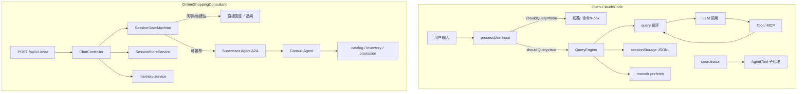

# Open-ClaudeCode 高价值借鉴指南

> 本文对照 [Open-ClaudeCode](D:\claudecode源码\Open-ClaudeCode-main\Open-ClaudeCode-main)（Claude Code 开源还原版）与本项目 **OnlineShoppingConsultant**，详细展开 **六项高价值架构借鉴**，并给出在本项目中的映射关系与落地建议。  
> 相关文档：[ARCHITECTURE.md](./ARCHITECTURE.md)、[CATEGORY_SLOT_REFACTOR.md](./CATEGORY_SLOT_REFACTOR.md)、[EVOLUTION.md](./EVOLUTION.md)

---

## 0. 阅读前提

### 0.1 两个项目的定位差异

| 维度 | Open-ClaudeCode (OCC) | OnlineShoppingConsultant (OSC) |
|------|----------------------|--------------------------------|
| 产品形态 | 终端 AI 编程助手 CLI | 电商导购 Web 后端 + Vue3 前端 |
| 运行时 | TypeScript / Bun | Java Spring Boot |
| 多 Agent | Coordinator + AgentTool 子代理 | Orchestrator + Consult Agent (A2A) |
| 工具 | 30+ 内置工具 + MCP 客户端 | Catalog / Inventory / Promotion MCP Server |
| 会话 | JSONL 转录文件 | Redis `SessionState` |
| 记忆 | 本地 `memdir` 文件目录 | `shopping-memory-service` (MySQL) |

### 0.2 借鉴原则

- **借鉴模式，不照搬代码**：OCC 是 TS 运行时，OSC 是 Java 业务后端，直接 copy 不可行。
- **优先补强已有架构**：OSC 已在做的 `SessionStateMachine`、品类槽位、MCP 拆分与 OCC 高度同构，重点是形式化与工程化。
- **按 ROI 分阶段落地**：每项借鉴均标注优先级（P0 / P1 / P2）与预期收益。

### 0.3 总体架构对照



---

## 1. QueryEngine + query 循环 — 会话编排核心

**OCC 路径：** `src/QueryEngine.ts`、`src/query.ts`  
**OSC 对应：** `ChatController`、`SessionStateMachine`、`SupervisorAgent`  
**优先级：** P0

### 1.1 OCC 做了什么

#### QueryEngine — 会话生命周期所有者

`QueryEngine` 是 **一个对话会话的编排器**，不是无状态 HTTP handler。它持有：

- 消息历史（`messages`）
- 文件/工具状态缓存
- Token 用量与成本
- 权限拒绝记录
- MCP 连接引用

对外 API 是 `submitMessage()`，内部流程：

```
submitMessage()
  → processUserInput()     // 预处理
  → query()                // Agent 主循环
  → recordTranscript()     // 持久化
  → yield SDK 事件流       // stream_event / assistant / result
```

#### query.ts — 显式 Agent 主循环

`query()` 是一个 **async generator**，核心结构：

```typescript
// 简化后的结构
async function* queryLoop(params) {
  let state: State = { messages, toolUseContext, turnCount: 1, transition: undefined }

  while (true) {
    // 1. prefetch 记忆 / skills
    // 2. 调用 LLM（流式）
    // 3. 解析 tool_use → runTools()
    // 4. 将 tool_result 追加到 messages
    // 5. 判断终止或继续

    if (shouldStop) {
      return { reason: 'completed' }           // Terminal
    }
    if (turnCount >= maxTurns) {
      return { reason: 'max_turns', turnCount }
    }
    state = { ...state, transition: { reason: 'next_turn' } }  // Continue
  }
}
```

**关键设计：**

| 概念 | 说明 |
|------|------|
| `State` | 跨迭代可变状态（messages、turnCount、transition 等） |
| `Continue` | 上一轮为何继续（`next_turn`、`reactive_compact_retry`…） |
| `Terminal` | 循环终止原因（`completed`、`max_turns`、`aborted_tools`…） |
| AsyncGenerator | 每步 `yield` 流式事件，而非等全部完成再返回 |
| `maxTurns` / `maxBudgetUsd` | 防止 Agent 工具调用死循环 |

**已知 Terminal reason（节选）：**

- `completed` — 正常结束
- `max_turns` — 超过轮次上限
- `next_turn` — 继续下一轮（Continue，非 Terminal）
- `stop_hook_blocking` — Hook 拦截
- `reactive_compact_retry` — 上下文压缩后重试
- `aborted_tools` / `aborted_streaming` — 用户取消
- `prompt_too_long` — 上下文超限

### 1.2 OSC 现状

当前 `ChatController.chat()` 已实现 **三层分流 + SSE 流式**：

```
1. prepareContext()           → SessionStateMachine.process()
2. isSmallTalkOrNonShopping() → 直接回复（不进 Agent）
3. buildClarificationIfNeeded() → 追问（不进 Agent）
4. streamAgentReply()         → Supervisor → Consult Agent（A2A 流式）
```

SSE 事件类型：`session` / `delta` / `done` / `error`。

`SessionProcessResult` 返回结构化结果，但 **没有显式的 TurnOutcome 枚举**，终止/继续逻辑分散在 `ChatController` 的 if 分支中。

### 1.3 差距分析

| OCC 能力 | OSC 现状 | 差距 |
|----------|----------|------|
| 显式 transition reason | `intentType` + 多个 if 分支 | 状态转移不可枚举、难测试 |
| Generator 流式分层 | 仅有 `delta`，无 tool_progress | 前端看不到工具执行进度 |
| maxTurns 守卫 | Agent 侧隐式 | 缺少 orchestrator 级轮次上限 |
| 上下文压缩 | 无 | 长会话 turns 截断但无摘要 |
| 用量/成本追踪 | 无 | 无法监控 LLM 开销 |

### 1.4 落地建议

#### 建议 A：引入 `TurnOutcome` 枚举（P0）

在 `SessionProcessResult` 或独立 DTO 中增加：

```java
public enum TurnOutcome {
    SMALL_TALK,           // 闲聊，直接回复
    NON_SHOPPING,         // 非购物，直接回复
    NEED_CLARIFICATION,   // 缺槽位 / 低置信度品类，追问
    READY_FOR_AGENT,      // 约束已就绪，调用 Consult Agent
    CATEGORY_REPLACED,    // 本轮发生品类 Replace（可观测）
    CATEGORY_UNCHANGED    // 品类未变
}
```

`ChatController` 改为 `switch (outcome)`，替代多个布尔判断。

#### 建议 B：标准化 SSE 事件（P1）

扩展事件类型，对齐 OCC 的 `StreamEvent` 分层：

| 事件 | 载荷 | 场景 |
|------|------|------|
| `session` | sessionId | 已有 |
| `delta` | content | 已有 |
| `tool_start` | toolName, args摘要 | Consult Agent 调 MCP 前 |
| `tool_end` | toolName, status | MCP 返回后 |
| `state` | outcome, categoryId | 槽位状态变更 |
| `done` | reply, debug | 已有 |
| `error` | message | 已有 |

#### 建议 C：Agent 轮次守卫（P1）

在 `application.yml` 增加：

```yaml
shopping:
  agent:
    max-tool-turns: 8
    max-budget-tokens: 50000
```

Orchestrator 在 `streamAgentReply` 包装层计数，超限则 `done` + 兜底话术。

#### 建议 D：上下文压缩（P2）

借鉴 OCC `services/compact/`：当 `turns.size() > maxTurns` 时，保留：

- 完整 `sessionContext`（槽位状态）
- 最近 3 轮原文
- 更早轮次 LLM 摘要（异步生成）

---

## 2. processUserInput — 进 Agent 前的预处理链

**OCC 路径：** `src/utils/processUserInput/processUserInput.ts` 及子模块  
**OSC 对应：** `ChatController.prepareContext()` + `SessionStateMachine`  
**优先级：** P0

### 2.1 OCC 做了什么

`processUserInput()` 是用户输入进入 `query()` 循环前的 **唯一入口**，职责：

```
用户原始输入
  → UserPromptSubmit Hook
  → 附件处理（图片等）
  → 斜杠命令解析（/commit、/review…）
  → Bash 命令解析
  → 普通文本 → processTextPrompt
  → 返回 ProcessUserInputResult
```

**返回值结构：**

```typescript
type ProcessUserInputBaseResult = {
  messages: Message[]       // 写入对话历史的消息
  shouldQuery: boolean      // 是否进入 query 主循环
  allowedTools?: string[]   // 本轮允许的工具子集
  model?: string            // 指定模型
  resultText?: string       // shouldQuery=false 时的直接输出
  nextInput?: string        // 链式命令的下一输入
}
```

**核心语义 — `shouldQuery`：**

| shouldQuery | 含义 | 示例 |
|-------------|------|------|
| `true` | 需要 LLM + 工具循环 | 普通编程问题 |
| `false` | 预处理已足够，短路返回 | 斜杠命令、Hook 拦截、纯展示 |

这是 OCC 最重要的 **门控机制**：避免所有输入都进昂贵的 Agent 循环。

### 2.2 OSC 现状

OSC 的预处理链（`prepareContext` → `SessionStateMachine.process`）：

```
1. SessionStoreService.getSession()         读 Redis
2. MemoryClientService.getProfile()         读长期画像（同步）
3. ContextExtractionService.extractPatch()  LLM 抽 JSON patch
4. CategoryPatchNormalizer.normalize()      品类 patch 清洗
5. CategoryIntentDetector.reconcile()       品类意图纠偏
6. ContextMergeService.mergeSessionPatch()  合并槽位
7. CategoryResolutionService.resolve()      HTTP 调 catalog 归一化
8. ContextMergeService.buildEffectiveContext() 生成 resolvedConstraints
```

`ChatController` 再用 `intentType` 和 `buildClarificationIfNeeded()` 决定是否调 Agent。

**等价关系：**

| OCC | OSC |
|-----|-----|
| `processUserInput` | `prepareContext` + `SessionStateMachine.process` |
| `shouldQuery: false` | `isSmallTalkOrNonShopping` / `clarification != null` |
| `shouldQuery: true` | `streamAgentReply` |
| `allowedTools` | Consult Agent 的 MCP 工具集（目前未动态裁剪） |
| 斜杠命令 | **尚未实现** |

### 2.3 差距分析

- 预处理步骤已较完整，但 **散落在多个 Service**，缺少统一的 `ProcessResult` 门控对象。
- 没有 **结构化命令** 短路（如用户说「/compare」「/查库存」可走规则，不必 LLM 抽取）。
- `getProfile()` 同步阻塞，未与品类解析并行（OCC 的 prefetch 模式）。
- Hook 扩展点缺失，业务规则硬编码在 Service 中。

### 2.4 落地建议

#### 建议 A：统一预处理门面 `UserInputProcessor`（P0）

```java
public record UserInputProcessResult(
    TurnOutcome outcome,
    ChatPreparedContext prepared,
    String directReply,        // outcome 为 SMALL_TALK / NEED_CLARIFICATION 时
    Set<String> allowedTools   // outcome 为 READY_FOR_AGENT 时
) {}
```

`ChatController` 只调一个方法，内部分派到现有 Service。

#### 建议 B：结构化意图短路（P1）

在 `CategoryIntentDetector` 之前增加轻量规则层：

| 用户输入模式 | 动作 | shouldQuery |
|-------------|------|-------------|
| 「你好」「谢谢」 | 模板回复 | false |
| 「/compare  A B」 | 调 catalog compare API | false（或 true 仅 compare 工具） |
| 「推荐手机」 | 走完整 LLM 抽取 | true |

规则层用配置驱动（`shopping.intent.shortcuts`），避免硬编码字符串。

#### 建议 C：并行 Prefetch（P1）

```
并行 {
  memoryClientService.getProfile(userId)
  // 若 session 已有 categoryRaw，可并行 resolve
}
  ↓
SessionStateMachine.process()
```

参考 OCC `startRelevantMemoryPrefetch`：记忆加载不阻塞首步槽位处理。

#### 建议 D：预处理 Hook 点（P2）

| Hook 时机 | OSC 接入点 | 用途 |
|-----------|-----------|------|
| UserPromptSubmit | `UserInputProcessor` 入口 | 注入促销上下文 |
| PreAgentInvoke | `streamAgentReply` 前 | 校验 categoryId 最新 |
| PostAgentInvoke | `finalizeAgentStream` 后 | 推荐结果合规检查 |

---

## 3. Tool.ts + services/mcp/ — 统一工具抽象

**OCC 路径：** `src/Tool.ts`、`src/services/mcp/`（约 23 文件）  
**OSC 对应：** `shopping-*-mcp-server`、`ConsultAgent` MCP 调用、`CategoryClientService`  
**优先级：** P1

### 3.1 OCC 做了什么

#### Tool 统一契约

所有工具（内置 + MCP 包装）实现同一接口：

```typescript
type Tool<Input, Output> = {
  name: string
  inputSchema: ZodSchema        // 参数校验
  description(): string
  call(input, context): Promise<Output>
  // 能力元数据
  isConcurrencySafe?: boolean   // 可并行执行
  isReadOnly?: boolean          // 无副作用
  isDestructive?: boolean       // 需额外确认
  shouldDefer?: boolean         // 延迟加载
}
```

#### ToolUseContext — 贯穿调用链的上下文

```typescript
type ToolUseContext = {
  messages: Message[]
  mcpClients: MCPServerConnection[]
  abortController: AbortController
  canUseTool: CanUseToolFn      // 权限门控
  agentId?: string
  // ...
}
```

每次工具调用都携带完整运行时上下文，而非散落的全局变量。

#### MCP 客户端层

`services/mcp/client.ts` 负责：

| 能力 | 说明 |
|------|------|
| 多传输协议 | stdio / SSE / HTTP / WebSocket |
| 连接生命周期 | 连接、重连、OAuth 刷新 |
| 工具发现 | `listTools()` → 包装为 `MCPTool` |
| 工具调用 | `callTool()` + 结果截断 |
| Elicitation | MCP 向用户请求确认（表单/URL） |
| 工具名规范化 | `mcp__serverName__toolName` |

### 3.2 OSC 现状

工具分布在三个层次：

```
Orchestrator
  ├─ CategoryClientService     HTTP 调 catalog /normalize（非 MCP）
  └─ Supervisor → Consult Agent (A2A)

Consult Agent
  └─ loadbalancedMcpSyncToolCallbacks (Nacos 发现)
       ├─ catalog: searchProduct, getProductDetail
       ├─ inventory: checkStock
       └─ promotion: getPromotions
```

- MCP 调用在 **Consult Agent 内部**，Orchestrator 不直接调 MCP 工具。
- 没有统一的 `Tool` Java 接口；各 Client/Callback 各自实现。
- `CategoryClientService` 是 REST 调用，与 MCP 工具层割裂。

### 3.3 差距分析

| OCC 能力 | OSC 现状 | 影响 |
|----------|----------|------|
| 统一 Tool 接口 | 分散的 Service / MCP Callback | 难以做权限、并行、追踪 |
| `isConcurrencySafe` | 未标记 | catalog + inventory 本可并行 |
| 工具结果截断 | 无 | 大商品列表可能撑爆上下文 |
| Elicitation | 用 `pendingField` 部分覆盖 | 未与 MCP 协议对齐 |
| Orchestrator 级工具层 | 仅 HTTP normalize | 编排器无法直接调工具 |

### 3.4 落地建议

#### 建议 A：定义 Java `ShoppingTool` 接口（P1）

```java
public interface ShoppingTool<I, O> {
    String name();
    boolean isReadOnly();
    boolean isConcurrencySafe();
    O call(I input, ToolContext ctx);
}

public record ToolContext(
    String userId,
    String sessionId,
    Map<String, Object> resolvedConstraints,
    String categoryId
) {}
```

MCP 工具通过 `McpToolAdapter` 实现该接口，REST 工具（如 normalize）通过 `HttpToolAdapter` 实现。

#### 建议 B：工具能力注册表（P1）

```java
@Service
public class ToolRegistry {
    Map<String, ShoppingTool<?, ?>> tools;
    List<ShoppingTool<?, ?>> concurrentSafeTools();
    ShoppingTool<?, ?> resolve(String name);
}
```

Consult Agent 从 Registry 获取允许的工具子集（对应 OCC `allowedTools`）。

#### 建议 C：并行工具执行（P1）

当 Consult Agent 需同时「搜商品 + 查库存」：

```java
CompletableFuture.allOf(
    catalogTool.callAsync(searchInput, ctx),
    inventoryTool.callAsync(stockInput, ctx)
);
```

仅在 `isConcurrencySafe=true` 的工具上启用。

#### 建议 D：结果截断策略（P2）

借鉴 OCC `toolResultStorage`：

| 工具 | 截断策略 |
|------|----------|
| searchProduct | 最多 10 条入 LLM，完整列表存 session sidecar |
| getPromotions | 摘要前 5 条 |

#### 建议 E：Elicitation 对齐（P2）

将 OSC 的 `pendingField` 与 MCP Elicitation 协议概念对齐：

- `pendingField=category` ≈ MCP 向用户 elicit 确认品类
- 统一返回结构：`{ action: "elicit", field, options, message }`

---

## 4. coordinator + AgentTool — 监督者 / 工作者模式

**OCC 路径：** `src/coordinator/coordinatorMode.ts`、`src/tools/AgentTool/`  
**OSC 对应：** `SupervisorAgent`、`shopping-consult-agent`、A2A 路由  
**优先级：** P0（架构验证）/ P1（增强）

### 4.1 OCC 做了什么

#### Coordinator 模式

Coordinator 是 **监督者**，自己不执行具体任务，而是：

- 通过 `AgentTool` 派发 Worker（子 Agent）
- 通过 `SendMessageTool` 继续已有 Worker
- 通过 `TaskStopTool` 停止 Worker
- 汇总 Worker 结果后回复用户

关键约束（`getCoordinatorSystemPrompt`）：

- Coordinator **只对用户说话**，Worker 结果是内部信号
- Worker 有 **受限工具集**（`ASYNC_AGENT_ALLOWED_TOOLS`）
- Worker 可访问 Coordinator 连通的 MCP 服务器

#### Scratchpad — 跨 Worker 共享状态

```typescript
// coordinatorMode.ts
if (scratchpadDir && isScratchpadGateEnabled()) {
  content += `\n\nScratchpad directory: ${scratchpadDir}\nWorkers can read and write here...`
}
```

Scratchpad 是 **与对话历史分离的共享工作区**，存放跨 Worker 的中间结果。

#### AgentTool.runAgent — 子 Agent 即嵌套 query()

```typescript
// runAgent.ts 简化流程
async function* runAgent(params) {
  const subContext = createSubagentContext(parentContext)
  const subTools = filterTools(parentTools, agentDefinition.allowedTools)
  const subMcpClients = connectAdditionalMcp(agentDefinition.mcpServers)

  yield* query({
    messages: [userMessage],
    toolUseContext: subContext,
    systemPrompt: agentDefinition.systemPrompt,
    maxTurns: agentDefinition.maxTurns,
  })

  recordSidechainTranscript(agentId, messages)  // 独立转录
}
```

每个子 Agent 是 **完整嵌套的 query 循环**，有独立工具集、MCP、转录。

#### 会话模式恢复

`matchSessionMode()` 在 resume 时检查存储的 `sessionMode`（coordinator / normal）与当前环境是否一致，不一致则自动切换并警告。

### 4.2 OSC 现状

OSC 的监督者/工作者拆分：

```
ChatController (编排入口)
  → SessionStateMachine (理解与约束)
  → SupervisorAgent (LlmRoutingAgent, A2A 路由)
      → Consult Agent (执行推荐, MCP 工具链)
```

架构原则（`CATEGORY_SLOT_REFACTOR.md` / `EVOLUTION.md`）：

1. **Orchestrator 负责理解与约束**
2. **Consult Agent 负责执行推荐**
3. **Agent 只读 `resolvedConstraints`**
4. **长期记忆只由 Orchestrator 写入**

这与 OCC Coordinator/Worker 模型 **高度同构**。

### 4.3 差距分析

| OCC 能力 | OSC 现状 | 差距 |
|----------|----------|------|
| Scratchpad 共享状态 | `sessionContext` 混在 Redis | 缺「编排层共享 vs Agent 私有」分离 |
| Worker 工具白名单 | Consult Agent 固定工具集 | 未按场景动态裁剪 |
| 子 Agent 独立转录 | 仅 turns 文本 | 看不到 Consult 的工具调用链 |
| 继续 Worker | 每轮重新 A2A | 无 Agent thread 延续优化 |
| 会话模式恢复 | 无 | resume 时不校验状态机版本 |

### 4.4 落地建议

#### 建议 A：明确三层状态分离（P0）

| 状态层 | 存储位置 | 内容 | 谁能写 | 谁能读 |
|--------|----------|------|--------|--------|
| Scratchpad | `sessionContext` (Redis) | categoryId、预算、槽位 | Orchestrator | Orchestrator + Agent（只读） |
| Agent Thread | A2A threadId | Agent 推理上下文 | Consult Agent | Consult Agent |
| Transcript | `turns` (Redis) | 用户可见对话 | Orchestrator | 全部 |

对应 OCC：Scratchpad ≈ scratchpadDir，Transcript ≈ sessionStorage，Agent Thread ≈ sidechain。

#### 建议 B：Consult Agent 配置外置（P1）

借鉴 OCC `loadAgentsDir.ts`（markdown + frontmatter 定义 Agent）：

```yaml
# consult-agent-shopping.yaml
name: consult_agent
system_prompt: classpath:prompts/shopping-consult.txt
allowed_tools:
  - searchProduct
  - getProductDetail
  - checkStock
  - getPromotions
max_turns: 6
```

按场景加载不同 Agent 配置（如「比价专员」「预算顾问」）。

#### 建议 C：子 Agent 转录（P1）

在 `finalizeAgentStream` 中记录：

```java
public record AgentTrace(
    String agentId,
    String threadId,
    List<ToolCallRecord> toolCalls,
    String finalReply
) {}
```

存入 Redis 或 JSONL sidecar，与 `turns` 分离（对应 OCC `recordSidechainTranscript`）。

#### 建议 D：动态工具白名单（P2）

根据 `effectiveContext` 裁剪 Consult Agent 可用工具：

| 场景 | 允许工具 |
|------|----------|
| 仅浏览 | searchProduct |
| 已选 SKU | searchProduct, checkStock, getPromotions |
| 比价 | searchProduct, getProductDetail |

#### 建议 E：会话模式恢复（P2）

`SessionState` 增加 `stateMachineVersion` 字段，resume 时若版本不一致则清空槽位或提示用户。

---

## 5. memdir — 长期记忆召回

**OCC 路径：** `src/memdir/`（8 文件）  
**OSC 对应：** `shopping-memory-service`、`MemoryClientService`、`LongTermMemoryWriteService`  
**优先级：** P0（召回）/ P1（写入策略）

### 5.1 OCC 做了什么

#### 两层记忆结构

```
memdir/
├── MEMORY.md          # 索引（始终加载到 system prompt，有行数/字节上限）
├── budget.md          # 主题记忆：预算偏好
├── brands.md          # 主题记忆：品牌偏好
└── sizing.md          # 主题记忆：尺码
```

- `MEMORY.md`：目录索引，告诉模型「有哪些记忆文件、各自描述」
- 主题文件：按需加载，不全量灌入 prompt

#### 相关记忆召回 — findRelevantMemories

```typescript
// findRelevantMemories.ts
export async function findRelevantMemories(
  query: string,
  memoryDir: string,
  signal: AbortSignal,
  recentTools: readonly string[] = [],
  alreadySurfaced: ReadonlySet<string> = new Set(),
): Promise<RelevantMemory[]>
```

流程：

1. `scanMemoryFiles()` — 扫描所有记忆文件的 header（文件名 + 描述）
2. `selectRelevantMemories()` — 用 **side-query（小模型）** 从候选中选最多 5 个
3. 过滤 `alreadySurfaced` — 不重复加载上轮已展示的记忆
4. 返回文件路径 + mtime（新鲜度）

#### Prefetch 模式

在 `query.ts` 主循环中，记忆召回与 LLM 调用 **并行启动**：

```
startRelevantMemoryPrefetch(query)   // 非阻塞
  ↓（同时）
callLLM(messages)
  ↓
consumeRelevantMemories()            // LLM 返回后、下轮前注入
```

#### 写入策略 — memoryTypes.ts

OCC 明确区分：

- **该记**：用户明确表达的偏好、项目级决策
- **不该记**：临时上下文、已在工具调用中体现的信息
- **何时访问**：处理新 query 时先查 MEMORY.md 索引

### 5.2 OSC 现状

```
MemoryClientService.getProfile(userId)
  → GET /api/v1/memory/{userId}
  → 返回完整 profileJson Map

LongTermMemoryWriteService.write()
  → 从 extractedPatch + sessionContext 合并
  → PUT /api/v1/memory/{userId} merge
```

- **全量拉取**：每轮把整个 profile 塞进 `effectiveContext`
- **无相关性筛选**：用户问「推荐手机」时，「鞋码偏好」也会进入上下文
- **同步阻塞**：`getProfile()` 在 `prepareContext` 中同步调用
- 写入由 Orchestrator 单入口控制（这是优势，应保留）

### 5.3 差距分析

| OCC 能力 | OSC 现状 | 影响 |
|----------|----------|------|
| 索引 + 主题文件 | 单一 profileJson Map | 记忆膨胀后 prompt 噪音大 |
| 按 query 召回 Top-K | 全量 profile | 无关偏好干扰推荐 |
| Prefetch 并行 | 同步 GET | 增加首字延迟 |
| 去重 alreadySurfaced | 无 | 重复注入相同记忆 |
| 写入类型指导 | 有基本 merge 逻辑 | 缺「什么不该写入」规则 |

### 5.4 落地建议

#### 建议 A：记忆分段存储（P0）

将 `profileJson` 拆为逻辑段（可先在同一 JSON 内用 key 分区）：

```json
{
  "index": { "budget": "预算区间偏好", "brands": "品牌好恶", "sizing": "尺码" },
  "budget": { "default_max": 3000, "categories": { "phone": 4000 } },
  "brands": { "likes": ["Apple"], "dislikes": ["某品牌"] },
  "sizing": { "shoe": "42", "clothing": "L" }
}
```

#### 建议 B：按 query 召回 API（P0）

在 `memory-service` 新增：

```
POST /api/v1/memory/{userId}/recall
Body: { "query": "推荐手机", "topK": 5, "excludeKeys": ["sizing"] }
Response: { "segments": { "budget": {...}, "brands": {...} } }
```

召回策略（按优先级）：

1. 规则：query 含「手机」→ 召回 `budget.categories.phone` + `brands`
2. LLM side-query：对 index 描述做相关性排序（参考 OCC `selectRelevantMemories`）
3. 去重：排除 `excludeKeys`（上轮已注入的段）

#### 建议 C：Prefetch 并行（P1）

```java
CompletableFuture<Map<String, Object>> profileFuture =
    CompletableFuture.supplyAsync(() -> memoryClientService.recall(userId, query));

// 同时执行 SessionStateMachine.process()（不依赖 profile 的步骤）

Map<String, Object> profile = profileFuture.join();
// 再 buildEffectiveContext(sessionContext, profile)
```

#### 建议 D：写入过滤规则（P1）

在 `LongTermMemoryWriteService` 增加「不该写入」判断：

| 字段 | 是否写入长期记忆 | 原因 |
|------|-----------------|------|
| categoryRaw（临时品类） | 否 | 会话槽位，非长期偏好 |
| budget（用户明确说「以后预算都是 X」） | 是 | 长期偏好 |
| scene（「送礼」一次性场景） | 否 | 临时上下文 |
| brandPreferences（多次提及） | 是 | 长期偏好 |

参考 OCC `WHAT_NOT_TO_SAVE_SECTION` / `WHEN_TO_ACCESS_SECTION`。

#### 建议 E：记忆新鲜度（P2）

每条记忆段增加 `updatedAt`，召回时优先较新段（对应 OCC 的 `mtimeMs`）。

---

## 6. sessionStorage — 会话转录与可追溯性

**OCC 路径：** `src/utils/sessionStorage.ts`（约 5000 行）  
**OSC 对应：** `SessionStoreService`、`SessionState`、`SessionState.Turn`  
**优先级：** P1

### 6.1 OCC 做了什么

#### JSONL 追加式转录

每个会话对应一个 `.jsonl` 文件，每行一条 `Entry`：

```jsonl
{"type":"user","uuid":"aaa","parentUuid":null,"message":{...},"timestamp":...}
{"type":"assistant","uuid":"bbb","parentUuid":"aaa","message":{...}}
{"type":"progress","uuid":"ccc","parentUuid":"bbb","message":{...}}
{"type":"assistant","uuid":"ddd","parentUuid":"bbb","message":{...}}
```

#### parentUuid 链 — 消息 DAG 完整性

| 概念 | 说明 |
|------|------|
| `uuid` | 本条消息唯一 ID |
| `parentUuid` | 上一条 **链参与者** 的 uuid |
| `isChainParticipant` | user/assistant/attachment/system 参与链；**progress 不参与** |
| 作用 | resume/fork 时保证对话链不断裂 |

**为何不持久化 progress？**

> Progress 是 ephemeral UI 状态。若写入 JSONL 并参与 parentUuid 链，resume 时会导致链分叉，孤立真实对话消息（OCC issue #14373, #23537）。

#### 子 Agent 独立转录 — Sidechain

```typescript
recordSidechainTranscript(agentId, messages)
setAgentTranscriptSubdir(agentId)
```

每个子 Agent 有独立转录文件，不污染主对话链。

#### Transcript vs Ephemeral 分离

| 类型 | 持久化 | 参与 parentUuid 链 |
|------|--------|-------------------|
| user / assistant | 是 | 是 |
| attachment / system | 是 | 是 |
| progress（工具进度） | 否 | 否 |
| compact_boundary | 是（特殊处理） | 重置链 |

#### 压缩边界 — Compact Boundary

长会话触发压缩时插入 `compact_boundary` 条目，`parentUuid` 重置，之前的历史被摘要替代。

### 6.2 OSC 现状

```java
// SessionState.java
class SessionState {
    String userId;
    List<Turn> turns;              // 仅 role + content + ts
    Map<String, Object> sessionContext;
    String updatedAt;
}

// SessionStoreService.appendTurns()
turns.add(turn("user", userInput));
turns.add(turn("assistant", assistantReply));
if (turns.size() > maxTurns) {
    // 截断保留最近 maxTurns 条
}
```

存储：Redis JSON 序列化，TTL 7 天。

### 6.3 差距分析

| OCC 能力 | OSC 现状 | 影响 |
|----------|----------|------|
| parentUuid 链 | Turn 无 uuid/parentId | 无法追溯因果 |
| 子 Agent 转录 | 无 | Consult 工具调用不可见 |
| progress 分离 | 无 progress 事件 | 尚无此问题，但未来 SSE tool_progress 需分离 |
| 压缩边界 | 简单截断 | 丢失早期上下文语义 |
| append-only JSONL | Redis 覆盖写 | 无法做会话 fork / 审计回放 |
| 槽位变更因果 | `stateDebug` 仅在 done 事件 | 难以复盘「何时品类被 Replace」 |

### 6.4 落地建议

#### 建议 A：Turn 增加 lineage 字段（P1）

```java
public static class Turn {
    private String id;              // UUID
    private String parentId;        // 上一轮 Turn 的 id
    private String role;
    private String content;
    private String ts;
    private TurnKind kind;          // USER, ASSISTANT, TOOL_PROGRESS, STATE_CHANGE
    private Map<String, Object> meta;  // 可选：categoryId, outcome, toolName
}

public enum TurnKind {
    USER, ASSISTANT, TOOL_PROGRESS, STATE_CHANGE
}
```

`TOOL_PROGRESS` 不进入 LLM 上下文，仅用于前端展示和审计（对应 OCC progress 不入链）。

#### 建议 B：状态变更事件（P1）

每当 `SessionStateMachine` 发生品类 Replace 时，追加 `STATE_CHANGE` turn：

```json
{
  "kind": "STATE_CHANGE",
  "meta": {
    "event": "CATEGORY_REPLACED",
    "from": { "categoryId": "computer", "categoryRaw": "电脑" },
    "to": { "categoryId": "phone", "categoryRaw": "手机" },
    "trigger": "CategoryIntentDetector"
  }
}
```

直接解决 `CATEGORY_SLOT_REFACTOR.md` 中的复盘需求。

#### 建议 C：Agent Sidechain 转录（P1）

Redis 增加 sidecar key：

```
shopping:session:{userId}:{sessionId}:agent-trace
```

```java
public record AgentTraceEntry(
    String turnId,
    String agentId,
    String toolName,
    Map<String, Object> argsSummary,
    String resultSummary,
    long durationMs
) {}
```

#### 建议 D：压缩策略升级（P2）

当前 `maxTurns` 截断改为：

1. 保留全部 `sessionContext`（槽位不受影响）
2. 保留所有 `STATE_CHANGE` turn
3. 最近 N 轮 USER/ASSISTANT 原文
4. 更早的 USER/ASSISTANT 用 LLM 生成摘要 turn

#### 建议 E：可选 JSONL 审计日志（P2）

高价值会话异步写入 JSONL 文件或 DB：

```
logs/transcripts/{userId}/{sessionId}.jsonl
```

用于纠纷复盘、模型微调数据，不影响 Redis 热路径。

---

## 7. 落地路线图

### 7.1 阶段一（1~2 周）— 形式化现有能力

| 序号 | 借鉴项 | 动作 | 涉及模块 |
|------|--------|------|----------|
| 1 | query 循环 | 新增 `TurnOutcome` 枚举 | `SessionProcessResult`, `ChatController` |
| 2 | processUserInput | 抽取 `UserInputProcessor` 门面 | 新建 Service |
| 3 | coordinator | 文档化三层状态分离 | `SessionState`, `CATEGORY_SLOT_REFACTOR.md` |
| 4 | memdir | profile 分段 + `recall` API 设计 | `memory-service`, `MemoryClientService` |

### 7.2 阶段二（2~4 周）— 工程增强

| 序号 | 借鉴项 | 动作 | 涉及模块 |
|------|--------|------|----------|
| 5 | Tool 抽象 | `ShoppingTool` 接口 + Registry | orchestrator 新建 tool 包 |
| 6 | sessionStorage | Turn lineage + STATE_CHANGE 事件 | `SessionState`, `SessionStateMachine` |
| 7 | SSE | 增加 `tool_start` / `state` 事件 | `ChatController`, `ChatView.vue` |
| 8 | memdir | Prefetch 并行 + 写入过滤 | `ChatController`, `LongTermMemoryWriteService` |

### 7.3 阶段三（按需）— 扩展与运维

| 序号 | 借鉴项 | 动作 |
|------|--------|------|
| 9 | coordinator | Agent 配置外置 + 动态工具白名单 |
| 10 | sessionStorage | JSONL 审计日志 + 压缩摘要 |
| 11 | hooks | 促销/会员规则插件化 |
| 12 | telemetry | OTEL span 覆盖上下文管道 |

---

## 8. 六项借鉴一句话总结

| # | 借鉴项 | 一句话 |
|---|--------|--------|
| 1 | QueryEngine + query 循环 | 会话要有「所有者」和「显式状态转移」，流式事件分层输出 |
| 2 | processUserInput | 进 Agent 前统一门控，能短路就不调 LLM |
| 3 | Tool + MCP | 所有工具统一接口，标能力元数据，支持并行与截断 |
| 4 | coordinator + AgentTool | 监督者理解约束、工作者执行工具，共享状态与私有推理分离 |
| 5 | memdir | 记忆分段、按 query 召回、并行 prefetch、谨慎写入 |
| 6 | sessionStorage | 对话转录有 lineage，工具进度与状态变更可审计 |

---

## 9. 参考文件索引

### Open-ClaudeCode 关键源文件

| 模块 | 路径 |
|------|------|
| 会话编排 | `src/QueryEngine.ts` |
| Agent 主循环 | `src/query.ts` |
| 工具契约 | `src/Tool.ts` |
| MCP 客户端 | `src/services/mcp/client.ts` |
| 输入预处理 | `src/utils/processUserInput/processUserInput.ts` |
| 协调者模式 | `src/coordinator/coordinatorMode.ts` |
| 子 Agent | `src/tools/AgentTool/runAgent.ts` |
| 记忆索引 | `src/memdir/memdir.ts` |
| 记忆召回 | `src/memdir/findRelevantMemories.ts` |
| 会话转录 | `src/utils/sessionStorage.ts` |

### 本项目关键源文件

| 模块 | 路径 |
|------|------|
| 聊天入口 | `shopping-orchestrator/.../controller/ChatController.java` |
| 状态机 | `shopping-orchestrator/.../service/SessionStateMachine.java` |
| 会话存储 | `shopping-orchestrator/.../service/SessionStoreService.java` |
| 记忆客户端 | `shopping-orchestrator/.../service/MemoryClientService.java` |
| 记忆写入 | `shopping-orchestrator/.../service/LongTermMemoryWriteService.java` |
| 会话 DTO | `shopping-orchestrator/.../dto/SessionState.java` |
| 品类改造记录 | `docs/CATEGORY_SLOT_REFACTOR.md` |

---

*文档版本：2026-06-09 · 基于 Open-ClaudeCode v2.1.88 源码与 OSC 当前 master 分支对照编写*
