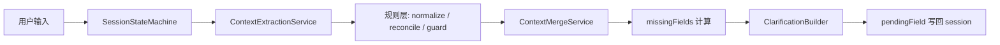
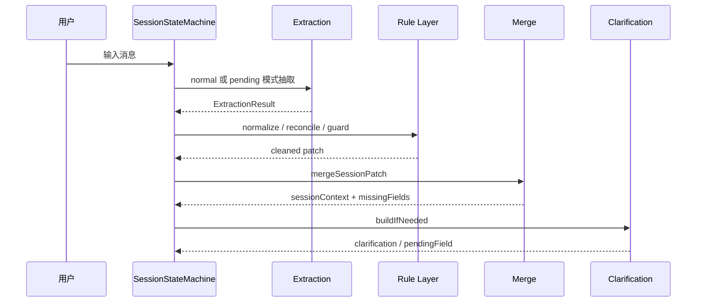

# 结构化输出与槽位抽取预改造文档

> 本文档是 **预改造方案**，目标不是立刻改代码，而是先把“结构化输出”和“槽位抽取”这两套逻辑的边界、目标形态、迁移路径定义清楚，便于后续按阶段落地。

---

## 1. 背景

当前 `shopping-orchestrator` 的上下文抽取链路已经具备基本能力：

- LLM 先抽取 `patch`
- 代码再做归一化、规则纠偏、合并、缺槽计算
- 如果存在 `pendingField`，再走追问模式抽取

整体方向是对的，但现在仍有两个明显问题：

1. **结构化输出不够硬**
   - 目前 LLM 输出先按文本接收，再 `readValue` 成 `Map`
   - 解析失败就走 fallback
   - 输出字段和状态字段混在一起，缺少显式约束

2. **槽位抽取职责不够清晰**
   - 普通抽取和追问抽取都依赖类似的 JSON patch 机制
   - 但两者的目标不同：
     - 普通抽取：从当前用户消息里提取尽可能多的候选信息
     - 追问抽取：围绕 `pendingField` 判断用户是否真正回答，以及是否继续保留追问状态

本次预改造的核心目标，就是把这两件事拆清楚。

---

## 2. 现状

当前相关入口主要是：

- `[ContextExtractionService.java](../shopping-orchestrator/src/main/java/com/onlineshopping/orchestrator/service/ContextExtractionService.java)`
- `[SessionStateMachine.java](../shopping-orchestrator/src/main/java/com/onlineshopping/orchestrator/service/SessionStateMachine.java)`
- `[ClarificationBuilder.java](../shopping-orchestrator/src/main/java/com/onlineshopping/orchestrator/service/ClarificationBuilder.java)`
- `[ContextMergeService.java](../shopping-orchestrator/src/main/java/com/onlineshopping/orchestrator/service/ContextMergeService.java)`

现有流程可以概括为：



这条链路本身没有问题，但“LLM 输出格式”和“抽取结果语义”还可以继续收敛。

---

## 3. 预改造目标

### 3.1 结构化输出目标

把当前“LLM 输出一段 JSON 字符串，代码再解析成 Map”的方式，升级为更明确的抽取结果对象：

- LLM 输出必须是一个可校验的结构化结果
- 业务 patch 和状态字段分离
- 解析失败、字段缺失、字段冲突都能被显式处理

### 3.2 槽位抽取目标

把当前统一抽取器拆成两个明确模式：

- `normal` 模式：普通用户输入抽取
- `pending` 模式：追问回答抽取

两种模式共享底层 schema，但语义不同：

- 普通抽取更宽
- 追问抽取更窄，更强调是否回答了当前 `pendingField`

---

## 4. 预改造方案一：结构化输出

### 4.1 当前问题

现在的实现有几个典型风险：

- LLM 输出不是强约束对象，只是“尽量输出 JSON”
- `Map<String, Object>` 容易导致 key 漏写、拼错、语义混杂
- `fallbackPatch(...)` 虽然保底，但语义上偏粗
- 状态字段如 `answeredPendingField`、`shouldKeepPending` 和业务字段混在一起，后续逻辑判断会越来越复杂

### 4.2 目标结构

建议把 LLM 输出定义为一个明确的抽取结果对象，例如：

```json
{
  "patch": {
    "categoryRaw": "手机",
    "budget": {
      "min": null,
      "max": 3000,
      "certainty": "HIGH"
    },
    "brandPreferences": ["小米"]
  },
  "answeredPendingField": true,
  "shouldKeepPending": false,
  "confidence": 0.92,
  "evidence": ["我想买手机", "预算3000左右"]
}
```

### 4.3 字段拆分原则

建议分成三类字段：

#### A. 业务 patch
真正要 merge 到 session 的信息，例如：

- `categoryRaw`
- `budget`
- `scene`
- `brandPreferences`
- `dislikes`
- `mustHave`
- `compareTargets`

#### B. 状态字段
只描述本轮抽取结果，不直接进入业务上下文，例如：

- `answeredPendingField`
- `shouldKeepPending`
- `confidence`
- `evidence`

#### C. 元信息字段
用于调试和后续分析，例如：

- `sourceMode`，例如 `normal` / `pending`
- `modelName`
- `parseStatus`

### 4.4 预期收益

- 解析更稳定
- 状态与业务边界更清晰
- 后续测试更容易写
- debug 时能快速看出 LLM 为什么这么抽

---

## 5. 预改造方案二：槽位抽取

### 5.1 普通抽取模式

普通抽取适用于：

- 用户首次表达需求
- 用户新增约束
- 用户改需求

目标不是“判断用户是不是在回答追问”，而是尽量从当前输入中抽出所有可能有效的信息。

例如：

- 用户说“我想买手机，预算3000”
- 普通抽取可以提取：
  - `categoryRaw = 手机`
  - `budget.max = 3000`

### 5.2 追问抽取模式

追问抽取适用于：

- 当前 session 中已经存在 `pendingField`
- 本轮用户大概率是在回答系统追问

它的任务不是全量抽取，而是围绕 `pendingField` 做窄范围判断：

- 用户是否真的回答了这个字段
- 回答是否足够明确
- 是否需要保留 `pendingField`

例如：

- 系统问的是 `scene`
- 用户回答“学习用”
- 那追问抽取重点应该是：
  - `answeredPendingField = true`
  - `scene = 学习`
  - `shouldKeepPending = false`

### 5.3 追问抽取和普通抽取的区别

| 维度 | 普通抽取 | 追问抽取 |
|---|---|---|
| 输入目标 | 当前整句用户消息 | 围绕 `pendingField` |
| 抽取范围 | 宽 | 窄 |
| 是否允许补充其他槽位 | 允许 | 允许，但要更保守 |
| 核心判断 | 能抽什么就抽什么 | 用户是否回答了正在追问的字段 |
| 输出状态 | 不一定需要 `answeredPendingField` | 必须重点给出 `answeredPendingField` 和 `shouldKeepPending` |

### 5.4 预期收益

- 减少追问轮“顺手污染旧槽位”的问题
- 降低用户回答很短时的误抽率
- 让追问逻辑更像明确的状态机，而不是隐式猜测

---

## 6. 目标时序



这个流程强调两点：

1. 抽取层和追问层是分开的
2. 规则层只修正和保护，不负责最终业务决策

---

## 7. 建议接口形态

### 7.1 抽取结果对象

建议后续把当前 `Map<String, Object>` 收敛成类似下面的 DTO：

```java
class ExtractionResult {
    Map<String, Object> patch;
    boolean answeredPendingField;
    boolean shouldKeepPending;
    double confidence;
    List<String> evidence;
    String sourceMode;
    String parseStatus;
}
```

### 7.2 抽取服务接口

建议保留两种入口：

```java
ExtractionResult extractPatch(String userMessage, Map<String, Object> sessionContext);

ExtractionResult extractPendingFieldPatch(
    String pendingField,
    String userMessage,
    Map<String, Object> sessionContext
);
```

但它们内部返回统一的结构化结果，而不是直接散成裸 `Map`。

### 7.3 规则层接口

规则层建议继续保留“可组合”的方式，但职责更固定：

- `normalize`
- `reconcile`
- `guard`

不要让某一层既负责纠偏，又负责最终状态判断。

---

## 8. 迁移分期

### Phase 0: 只定结构，不改行为

目标：

- 先定义 DTO 和 schema
- 先定义普通抽取与追问抽取的返回格式
- 不动现有业务逻辑

### Phase 1: 把解析结果对象化

目标：

- LLM 输出先落到 DTO
- 再从 DTO 转成现有 `patch`
- 保持现有 merge / clarify 逻辑不变

### Phase 2: 拆分普通抽取与追问抽取语义

目标：

- 普通抽取更宽
- 追问抽取更窄
- `answeredPendingField`、`shouldKeepPending` 明确化

### Phase 3: 逐步收紧规则

目标：

- 让规则层只做它该做的事
- 减少对 `Map` 的自由读写
- 增加失败重试、结构校验和测试覆盖

---

## 9. 风险点

### 9.1 过度抽象

如果一开始就把所有字段都做成特别复杂的 schema，可能会降低迭代速度。  
因此建议先收敛核心字段，再逐步扩展。

### 9.2 规则和抽取边界不清

如果后续规则层继续去“猜”业务字段，抽取层再强也会被污染。  
所以规则层要尽量只做：

- 归一化
- 纠偏
- 拦截

### 9.3 追问模式误伤

追问抽取如果过窄，可能会漏掉用户顺带补充的新信息。  
所以追问模式要允许“围绕 pendingField 的附带补充”，但要有明确的优先级和采纳规则。

---

## 10. 验收标准

如果后续按本方案改造，建议验收以下几点：

1. LLM 输出结构化结果对象，不再直接依赖裸 JSON 字符串
2. 普通抽取与追问抽取具有不同语义
3. `answeredPendingField` 与 `shouldKeepPending` 的判断可追踪、可测试
4. 追问轮不容易把旧类目、旧预算、旧上下文重新污染进来
5. 规则层只做规定动作，不再混入过多业务判断

---

## 11. 相关代码

- `[ContextExtractionService.java](../shopping-orchestrator/src/main/java/com/onlineshopping/orchestrator/service/ContextExtractionService.java)`
- `[SessionStateMachine.java](../shopping-orchestrator/src/main/java/com/onlineshopping/orchestrator/service/SessionStateMachine.java)`
- `[ClarificationBuilder.java](../shopping-orchestrator/src/main/java/com/onlineshopping/orchestrator/service/ClarificationBuilder.java)`
- `[ContextMergeService.java](../shopping-orchestrator/src/main/java/com/onlineshopping/orchestrator/service/ContextMergeService.java)`

