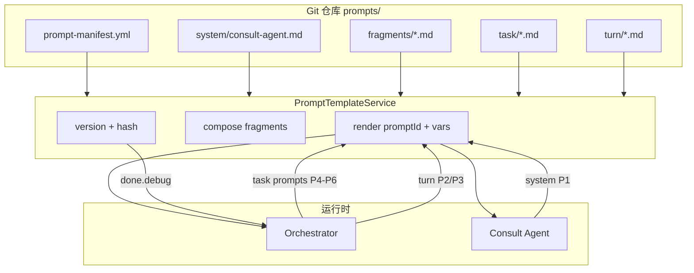

# Prompt 管理方案（Git 文件化 + 分层加载）

> 本文给出 OnlineShoppingConsultant 的 Prompt 治理详细方案，借鉴 Open-ClaudeCode（OCC）的 `loadAgentsDir`、分层 system prompt、`CLAUDE.md` 文件化思路，并贴合本项目 B2C 导购架构。  
> 相关文档：  
> - [SEARCH_FIRST_PREFETCH.md](./SEARCH_FIRST_PREFETCH.md) — 先搜后答与 `prefetchedSearchResult`  
> - [SESSION_MEMORY_SEARCH_REFACTOR.md](./SESSION_MEMORY_SEARCH_REFACTOR.md) — 记忆分段召回  
> - [OPEN_CLAUDECODE_BORROWINGS.md](./OPEN_CLAUDECODE_BORROWINGS.md) — OCC 对照 §4.4 建议 B  

---

## 1. 目标与原则

### 1.1 要解决的问题

| 现状 | 问题 |
|------|------|
| `ContextExtractionService` 等 Java 三引号 | 难 diff、难评审、改 prompt 要编译 |
| `consult-agent` `application.yml` 大段 instruction | YAML 不适合长文本 |
| `ChatController` 与 consult-agent **规则重复** | 改一处漏一处，易不一致 |
| 无 `promptVersion` | 线上问题无法对应 prompt 版本 |
| 所有路径潜在加载全套 Agent 规则 | 浪费 token、职责不清 |

### 1.2 设计原则（与 OCC 对齐）

1. **Prompt 进 Git 文件，不进 Java 字符串**（产品级真相源 = 仓库）。
2. **分层 compose**：system / task / turn / fragment，按场景组装，不全量灌。
3. **代码裁决，Prompt 叙述**：搜索、品类、记忆写入等已在代码里的规则，不在 Prompt 重复写第三遍。
4. **能力与文案一致**：`allowed_tools` 与 prompt 正文同步（借鉴 OCC `loadAgentsDir` frontmatter）。
5. **可观测**：每轮 debug 带 `promptId` + `promptVersion` + 可选 hash。
6. **B2C 差异**：无「用户项目 `CLAUDE.md`」层；若未来做商家租户，再扩展 `tenant-overrides/`。

### 1.3 明确不放 Prompt 的内容

| 类型 | 放哪 |
|------|------|
| 品类证据门控 | `CategoryPatchGuard` |
| 搜索兜底顺序 | `ProductSearchFallback` |
| 预搜索执行 | `CatalogSearchPrefetchService` |
| 记忆写入门控 | `MemoryWriteFilter` |
| 追问固定话术 | `ClarificationBuilder`（`messages/` 可选外置，但不是 LLM system prompt） |
| JSON 解析与 fallback | Java 代码 |

---

## 2. 现状清单（迁移前）

| ID | 名称 | 当前位置 | 类型 | 触发条件 |
|----|------|----------|------|----------|
| P1 | consult-agent system | `shopping-consult-agent/.../application.yml` | system | 每次 Consult Agent 调用 |
| P2 | agent turn（预搜索） | `ChatController.buildPrefetchedUserInput` | turn/user | `READY_FOR_AGENT` + prefetched ok |
| P3 | agent turn（降级搜索） | `ChatController.buildLegacySearchUserInput` | turn/user | `READY_FOR_AGENT` + prefetched 不可用 |
| P4 | 上下文抽取 | `ContextExtractionService.extractPatch` | task | 每轮 `processSlots` |
| P5 | 追问字段抽取 | `ContextExtractionService.extractPendingFieldPatch` | task | 有 `pendingField` 时 |
| P6 | 画像整理 | `ProfileReconcileService.reconcile` | task | 长期记忆写入前 |

**重复最严重**：P1 与 P2/P3 中关于「只能推荐 products」「禁止编造」「matchType 解释」的条文。

---

## 3. 目标架构



### 3.1 四层分类（对应 OCC）

| 层 | OCC 类比 | 本项目 | 加载时机 |
|----|----------|--------|----------|
| **system** | 默认 product prompt + Agent `.md` | `consult-agent.md` | Consult Agent 进程启动 / 首次调用前 |
| **task** | 工具内 `prompt.ts`、side-query | `context-extraction.md` 等 | Orchestrator 调 LLM 抽槽/整理画像 |
| **turn** | Coordinator 传给 Worker 的 user 载荷 | `agent-turn-prefetched.md` | 仅 `READY_FOR_AGENT` |
| **fragment** | 可复用规则块 | `product-narration-rules.md` | 被 system/turn include |
| **messages** | `ClarificationBuilder` 非 LLM | `messages/clarification/*.properties` | 确定性回复，可选 Phase 3 |

### 3.2 与先搜后答的关系

```text
TurnOutcome.READY_FOR_AGENT
  ├─ prefetchedSearch.status = ok
  │    system: consult-agent.md（tools 不含 searchProduct 叙述）
  │    turn:   agent-turn-prefetched.md + 变量
  └─ prefetchedSearch.status = unavailable
       system: consult-agent.md（含 searchProduct 降级说明）
       turn:   agent-turn-legacy.md + 变量
```

---

## 4. 目录结构

### 4.1 shopping-orchestrator

```text
shopping-orchestrator/src/main/resources/
  prompt-manifest.yml
  prompts/
    fragments/
      output-format.md          # 不要 JSON/markdown/代码块
      product-narration-rules.md # 只推荐 authorized products、matchType、禁止编造（唯一真相源）
      no-clarification-as-reply.md
    task/
      context-extraction.md
      pending-field-extraction.md
      profile-reconcile.md
    turn/
      agent-turn-prefetched.md
      agent-turn-legacy.md
      notices/
        category-replaced.md    # 短通知，按需插入
        prefetch-failed.md
    messages/                   # Phase 3 可选
      clarification_zh.properties
```

### 4.2 shopping-consult-agent

```text
shopping-consult-agent/src/main/resources/
  prompt-manifest.yml           # 或引用 orchestrator 同版 fragment 的拷贝/子集
  prompts/
    system/
      consult-agent.md          # frontmatter + 正文
    fragments/
      product-narration-rules.md  # 与 orchestrator 同内容（或共享模块，见 §6.2）
```

### 4.3 consult-agent.md frontmatter 示例（借鉴 OCC Agent `.md`）

```markdown
---
id: consult-agent
version: 2026.06.11.1
description: 电商导购咨询 Worker Agent
allowed_tools:
  - getProductDetail
  - checkInventory
  - getPromotions
conditional_tools:
  searchProduct: when_prefetch_unavailable
max_turns: 8
---

{{> fragments/output-format.md}}

{{> fragments/product-narration-rules.md}}

## 工具说明
- getProductDetail / checkInventory / getPromotions：基于已授权 skuId 补充信息
- searchProduct：仅当主 Agent 未提供 prefetchedSearchResult（status=ok）时允许降级使用

## 输入约定
主 Agent 通过 user 消息传入 resolvedConstraints；可能包含 prefetchedSearchResult。
不要从历史对话猜测意图，以本轮结构化输入为准。
```

---

## 5. prompt-manifest.yml

Orchestrator 侧示例：

```yaml
version: 2026.06.11.1

prompts:
  context-extraction:
    path: classpath:prompts/task/context-extraction.md
    type: task
    variables: [sessionContext, userMessage]

  pending-field-extraction:
    path: classpath:prompts/task/pending-field-extraction.md
    type: task
    variables: [pendingField, sessionContext, userMessage]

  profile-reconcile:
    path: classpath:prompts/task/profile-reconcile.md
    type: task
    variables: [maxItemsPerField, existingProfile, incomingPatch, candidateBrands, candidateDislikes, candidateNotes, userMessage]

  agent-turn-prefetched:
    path: classpath:prompts/turn/agent-turn-prefetched.md
    type: turn
    includes:
      - fragments/output-format.md
      - fragments/product-narration-rules.md
    variables: [userId, userMessage, resolvedConstraints, prefetchedSearchResult, notices]

  agent-turn-legacy:
    path: classpath:prompts/turn/agent-turn-legacy.md
    type: turn
    includes:
      - fragments/output-format.md
      - fragments/product-narration-rules.md
    variables: [userId, userMessage, resolvedConstraints, notices]

fragments:
  product-narration-rules: classpath:prompts/fragments/product-narration-rules.md
  output-format: classpath:prompts/fragments/output-format.md

routing:
  consult_turn:
    when:
      - condition: prefetchedSearch.status == ok
        prompt: agent-turn-prefetched
      - condition: default
        prompt: agent-turn-legacy
```

Consult-agent 侧可只保留 `consult-agent` 一条，或引用同一 `version` 字段保持对齐。

---

## 6. 核心组件设计

### 6.1 `PromptTemplateService`（orchestrator + consult-agent 各一份，或抽 `shopping-common`）

```java
public interface PromptTemplateService {
    /** 渲染指定 prompt，替换 {{var}} 并展开 {{> fragment-id}} */
    RenderedPrompt render(String promptId, Map<String, Object> variables);

    /** 按 manifest routing 选择 turn prompt */
    RenderedPrompt renderRouted(String routingKey, Map<String, Object> context);

    String manifestVersion();
}

public record RenderedPrompt(
    String promptId,
    String version,
    String content,
    String contentHash   // SHA-256 前 8 位，写入 debug
) {}
```

**实现要点：**

- 启动时解析 `prompt-manifest.yml`，缓存 fragment 内容。
- 占位符：`{{userMessage}}`、`{{resolvedConstraints}}`（JSON 序列化）。
- Include：`{{> fragments/product-narration-rules.md}}` 在渲染前展开。
- 失败策略：找不到文件 → 启动失败（fail-fast），避免线上 silent 空 prompt。

### 6.2 跨模块共享 fragment 的三种选项

| 方案 | 做法 | 推荐 |
|------|------|------|
| A. 拷贝 | 两个模块各放一份相同 `product-narration-rules.md` | Phase 1 最快；CI 加一致性检查 |
| B. 公共模块 | `shopping-prompt-resources` jar，两模块依赖 | Phase 2，根治重复 |
| C. 仅 consult-agent 持有规则 | orchestrator turn 只注入数据，不写规则 | 最干净；依赖 A2A 传参稳定 |

**推荐路径**：Phase 1 用 A + 单测断言两段 hash 一致；Phase 2 升 B。

### 6.3 `AgentTurnPromptBuilder`（替代 ChatController 内联）

```java
@Service
public class AgentTurnPromptBuilder {
    public String build(ChatPreparedContext prepared, ChatRequest request) {
        Map<String, Object> vars = new LinkedHashMap<>();
        vars.put("userId", prepared.userId());
        vars.put("userMessage", request.getMessage());
        vars.put("resolvedConstraints", prepared.effectiveContext().get("resolvedConstraints"));
        vars.put("prefetchedSearchResult", prefetchedPayload(prepared.prefetchedSearch()));
        vars.put("notices", buildNotices(prepared));
        vars.put("prefetchedSearch", prepared.prefetchedSearch()); // routing 用
        return promptTemplateService.renderRouted("consult_turn", vars).content();
    }
}
```

`ChatController` 只调用 builder，不再持有三引号字符串。

### 6.4 Consult-agent 改造

```java
@Component
public class ConsultPromptConfig {
    private final PromptTemplateService promptTemplateService;

    public String getConsultAgentInstruction() {
        return promptTemplateService.render("consult-agent", Map.of()).content();
    }
}
```

`application.yml` 改为：

```yaml
agent:
  prompts:
    consult-agent-id: consult-agent
    manifest-version: ${PROMPT_MANIFEST_VERSION:}
```

正文迁到 `prompts/system/consult-agent.md`。

---

## 7. 去重策略（消除 P1/P2/P3 重复）

### 7.1 规则唯一来源：`fragments/product-narration-rules.md`

以下内容**只写在这一份**：

- 只能推荐 `products` / `prefetchedSearchResult.products` 中的商品
- 名称、价格必须与字段一致，禁止「约/大概」
- `matchType` 各枚举的解释
- 不足 3 款不凑数；空结果如实说明
- 非 exact 不假装精确命中

### 7.2 system vs turn 分工

| 层 | 写什么 | 不写什么 |
|----|--------|----------|
| **system**（consult-agent） | 角色、工具能力、输出格式、引用 fragment | 本轮 categoryId、具体 products |
| **turn**（orchestrator） | 本轮变量块、`prefetchedSearchResult` JSON、短 notices | 重复 11 条商品规则 |

### 7.3 turn 模板正文（精简后示意）

`agent-turn-prefetched.md`：

```markdown
请你作为导购咨询子 Agent，基于下列结构化输入回答。

{{> fragments/output-format.md}}
{{> fragments/product-narration-rules.md}}

{{#if notices}}
{{notices}}
{{/if}}

本轮约束：
- 系统已完成商品搜索；禁止调用 searchProduct。
- 只能使用 prefetchedSearchResult 中的商品事实。

userId: {{userId}}
userMessage: {{userMessage}}
resolvedConstraints: {{resolvedConstraints}}
prefetchedSearchResult: {{prefetchedSearchResult}}
```

---

## 8. 按需加载（不全量灌）

### 8.1 Prompt 路由表

| TurnOutcome | 加载的 prompt |
|-------------|---------------|
| `SMALL_TALK` / `NON_SHOPPING` | 无 LLM Agent prompt |
| `NEED_CLARIFICATION` | 无 Consult Agent；仅 `messages` 或 `ClarificationBuilder` |
| `READY_FOR_AGENT` | system（consult-agent）+ turn（prefetched 或 legacy） |
| 每轮槽位处理 | task：`context-extraction` 或 `pending-field-extraction` |
| 记忆写入 | task：`profile-reconcile`（仅 write 路径） |

### 8.2 记忆与 Prompt 的边界（配合 [SESSION_MEMORY_SEARCH_REFACTOR.md](./SESSION_MEMORY_SEARCH_REFACTOR.md)）

- 长期记忆 → `recall` segments → `ConstraintResolver` → **`resolvedConstraints` 结构化字段**
- Agent **不见**原始 `profileJson`；turn 模板只传 `resolvedConstraints`
- 补充项（Phase 1 记忆优化，与 prompt 并行）：
  - `excludeKeys` 增加上轮 `recalledMemoryKeys`
  - recall 失败禁止 `getProfile()` 全量 fallback

---

## 9. 可观测性

### 9.1 debug 字段（写入 `done.debug`）

```json
{
  "prompts": {
    "manifestVersion": "2026.06.11.1",
    "consultSystem": { "id": "consult-agent", "version": "2026.06.11.1", "hash": "a1b2c3d4" },
    "agentTurn": { "id": "agent-turn-prefetched", "version": "2026.06.11.1", "hash": "e5f6g7h8" }
  }
}
```

### 9.2 与 OCC 对齐

OCC 使用 `system_prompt_hash` + preview；本项目用 `contentHash` + `promptId` 即可，无需上 Prompt 平台也能排查「哪版规则导致编造」。

---

## 10. 实施路线图

### Phase 1 — 文件化 + 去重（1～2 天，必做）✅ 已实现

| 步骤 | 动作 |
|------|------|
| 1.1 | 创建 `prompts/` 目录与 `prompt-manifest.yml` |
| 1.2 | 抽出 `fragments/product-narration-rules.md`（从 P1/P2/P3 合并去重） |
| 1.3 | 迁移 P4～P6 到 `task/*.md` |
| 1.4 | 迁移 P2/P3 到 `turn/*.md`；P1 到 `consult-agent.md` |
| 1.5 | 实现 `PromptTemplateService`（classpath + `{{var}}` + `{{> include}}`） |
| 1.6 | 改造 `ContextExtractionService`、`ProfileReconcileService`、`ChatController`、`ConsultPromptConfig` |
| 1.7 | `done.debug.prompts` 输出 version/hash |
| 1.8 | 单测：`PromptTemplateServiceTest`（渲染快照）、fragment 跨模块 hash 一致 |

**验收**：`mvn test` 通过；发一轮聊天 `done.debug.prompts` 有值；改 fragment 一处，system 与 turn 行为一致。

### Phase 2 — 公共模块 + 路由（2～3 天）

| 步骤 | 动作 |
|------|------|
| 2.1 | 新建 `shopping-prompt-resources`（或 `shopping-common-prompts`）共享 fragment |
| 2.2 | `renderRouted("consult_turn", ctx)` 正式替代 if/else |
| 2.3 | frontmatter 解析：`allowed_tools` 写入 manifest，为动态工具白名单做准备 |
| 2.4 | 文档：本文件 + `SEARCH_FIRST_PREFETCH.md` 交叉引用 |

### Phase 3 — 可选增强

| 项 | 说明 |
|----|------|
| `messages/` 外置 | `ClarificationBuilder` 中文案迁到 properties |
| Nacos 热更新 | **仅** `consult-agent.md` 运行时覆盖；Git 仍为真相源 |
| `ProductReplyValidator` | 校验回复 vs `prefetchedSearch.products` |
| Langfuse / OTEL | prompt hash 关联 trace |

---

## 11. Nacos 热更新（可选，Phase 3）

**不建议 Phase 1 就做。** 若启用：

```text
优先级：Nacos 覆盖内容 > classpath 默认 consult-agent.md
仅 consult-agent 进程监听；orchestrator task/turn 仍 Git 发版
变更必须带 version 字段；Nacos 不可用时回退 classpath
```

与 OCC 对比：OCC **没有** Nacos prompt；热更新非必需能力。

---

## 12. 测试策略

| 测试 | 内容 |
|------|------|
| `PromptTemplateServiceTest` | 各 promptId 渲染不抛错；必填变量缺失时明确异常 |
| 快照测试 | `product-narration-rules` 渲染结果 hash 稳定 |
| 集成冒烟 | `READY_FOR_AGENT` + prefetched ok → turn id = `agent-turn-prefetched` |
| 回归对话 | 小米 3000 场景：matchType 解释正确、无库外型号的 prompt 约束仍在 |

---

## 13. 迁移检查清单

- [x] Java 中无超过 5 行的 LLM prompt 三引号字符串（除测试）— Phase 1 已完成
- [x] `application.yml` 无超过 10 行的 instruction 正文 — 已迁至 `consult-agent.md`
- [x] `product-narration-rules.md` 双模块各一份（内容一致，Phase 2 可抽公共 jar）
- [x] `ChatController` 无商品推荐规则正文 — 已迁至 `AgentTurnPromptBuilder` + turn 模板
- [x] `done.debug.prompts` 每轮 Agent 路径可见
- [ ] `prompt-manifest.yml` `version` 与发版 tag 同步更新约定（CHANGELOG）

---

## 14. 总结

| 问题 | 方案 |
|------|------|
| Prompt 放哪？ | **Git `prompts/*.md`**，与 OCC 产品仓库 + Agent `.md` 同思路 |
| 怎么组织？ | system / task / turn / fragment 四层 + `prompt-manifest.yml` |
| 怎么去重？ | 商品叙述规则进 **一个 fragment**，system 与 turn 引用 |
| 怎么按需加载？ | `TurnOutcome` + `prefetchedSearch.status` 路由，不全路径加载 |
| Nacos？ | Phase 3 可选，只覆盖 consult-agent system，Git 仍是主库 |
| 和先搜后答？ | turn 只注入 `prefetchedSearchResult`；规则在 fragment |

一句话：

> **借鉴 OCC 的「Agent markdown + frontmatter + 分层 system」，在 OSC 落地为 `prompt-manifest` + `PromptTemplateService` + 单一 `product-narration-rules` fragment；Prompt 放 Git，代码管行为，Prompt 管怎么说。**
