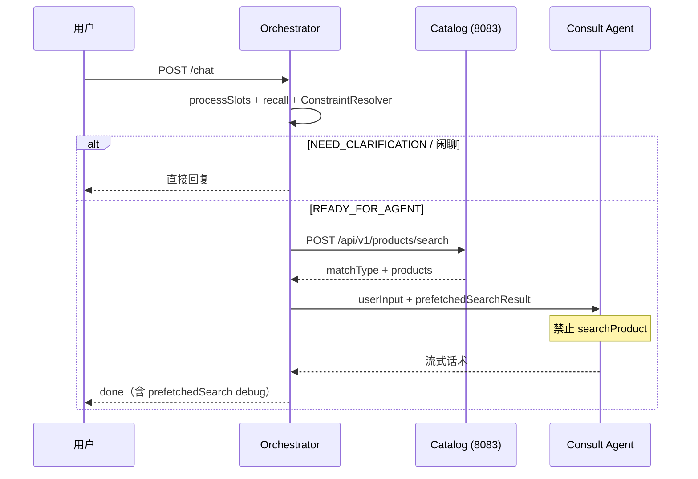

# Orchestrator 先搜后答（Prefetched Search）改造说明

> 本文记录「搜索由 Orchestrator 在调 Agent 之前完成，Agent 只基于预搜索结果写话术」这一改造的动机、设计与具体文件变更。  
> 相关文档：  
> - [SESSION_MEMORY_SEARCH_REFACTOR.md](./SESSION_MEMORY_SEARCH_REFACTOR.md) — 记忆 / 品牌 / 搜索兜底总览  
> - [OPEN_CLAUDECODE_BORROWINGS.md](./OPEN_CLAUDECODE_BORROWINGS.md) — P1 路线图 §7.2  

---

## 1. 为什么要改

### 1.1 改造前

```
用户消息
  → UserInputProcessor（槽位 + 记忆 + ConstraintResolver → searchHints）
  → READY_FOR_AGENT
  → Consult Agent 自行决定何时调 searchProduct
  → Catalog MCP 查 MySQL（唯一一次商品查询，但在 Agent 内）
  → Agent 自由生成推荐话术
```

问题：

| 现象 | 根因 |
|------|------|
| 要小米 ~3000，却推荣耀或编造型号 | 搜索参数由 LLM 传入 MCP，可能传错品类/品牌/预算 |
| `matchType` 泄露或解释不一致 | Agent 与工具两层决策，Orchestrator 看不到搜索事实 |
| 回复中出现库外型号（如「小米 14 Lite」） | 仅靠 Prompt 约束，无代码层「本轮授权商品集」 |

`ConstraintResolver` 虽已产出 `searchHints`，但**执行搜索的仍是 Agent**，属于「参数算对了、执行可能跑偏」。

### 1.2 改造后

```
用户消息
  → UserInputProcessor（槽位 + 记忆 + ConstraintResolver）
  → READY_FOR_AGENT 时：
       CatalogSearchPrefetchService → POST /api/v1/products/search（一次 MySQL 查询）
       → PrefetchedSearchResult（本轮 authorizedProducts）
  → Consult Agent 收到 prefetchedSearchResult
  → 禁止 searchProduct，只写话术（可调 getProductDetail / 库存 / 优惠）
  → done.debug.prefetchedSearch 可观测
```

设计原则：

> **搜索策略与查库在代码层完成；LLM 只叙述本轮已授权的商品事实。**

「白名单」不是额外表或二次全库扫描，而是**这次预搜索返回的 `products` 数组**（通常 1～5 条）。

---

## 2. 架构对比

### 2.1 时序（改造后）



### 2.2 降级路径

预搜索失败时（catalog 不可用、品类信号缺失等），`PrefetchedSearchResult.status = unavailable`，Agent Prompt 回退为「可按 `resolvedConstraints` 调用 `searchProduct`」，与改造前行为兼容。

| status | 含义 | Agent 行为 |
|--------|------|------------|
| `skipped` | 非 `READY_FOR_AGENT`（闲聊/追问等） | 不涉及搜索 |
| `ok` | 预搜索成功 | **禁止** `searchProduct`，只用 `prefetchedSearchResult` |
| `unavailable` | 预搜索失败 | 允许降级调用 `searchProduct` |

---

## 3. 模块与文件变更

### 3.1 shopping-catalog-mcp-server

| 文件 | 类型 | 说明 |
|------|------|------|
| `dto/ProductSearchRequest.java` | 新增 | REST 请求体：`categoryId`、`categoryRaw`、`keyword`、`minPrice`、`maxPrice`、`limit`、`semanticQuery` |
| `dto/ProductSearchResponse.java` | 新增 | REST 响应体：`matchType`、`message`、`categoryNormalization`、`brandKeyword`、`products` |
| `service/ProductSearchService.java` | 新增 | 从 `CatalogMcpTools` 抽出的统一搜索逻辑；内部调用 `ProductSearchFallback`（与 MCP 完全一致） |
| `controller/ProductController.java` | 新增 | `POST /api/v1/products/search` |
| `CatalogMcpTools.java` | 修改 | `searchProduct` 委托 `ProductSearchService`，消除 MCP 与 REST 双份逻辑 |

**新 API 示例**

```http
POST http://localhost:8083/api/v1/products/search
Content-Type: application/json

{
  "categoryId": "cat_phone",
  "keyword": "小米",
  "minPrice": 2500,
  "maxPrice": 3500,
  "limit": 5,
  "semanticQuery": "想买小米手机，预算3000"
}
```

响应字段与 MCP `searchProduct` JSON 对齐（`matchType`、`message`、`products` 等）。

### 3.2 shopping-orchestrator

| 文件 | 类型 | 说明 |
|------|------|------|
| `dto/PrefetchedSearchResult.java` | 新增 | 预搜索结果 DTO：`status`、`matchType`、`message`、`products`、`searchParams`、`error`；含 `toDebugMap()` |
| `dto/ChatPreparedContext.java` | 修改 | 增加字段 `PrefetchedSearchResult prefetchedSearch` |
| `service/CatalogSearchClientService.java` | 新增 | HTTP 客户端，调 catalog `POST /api/v1/products/search` |
| `service/CatalogSearchPrefetchService.java` | 新增 | 从 `effectiveContext.resolvedConstraints` + `searchHints` 组装搜索参数并调用 client |
| `service/UserInputProcessor.java` | 修改 | `READY_FOR_AGENT` 时调用 `catalogSearchPrefetchService.prefetch()` |
| `controller/ChatController.java` | 修改 | 注入 `prefetchedSearchResult` 到 Agent prompt；`done.debug` 增加 `prefetchedSearch` |
| `src/main/resources/application.yml` | 修改 | 新增 `shopping.catalog.search-limit`（默认 5） |
| `test/.../CatalogSearchPrefetchServiceTest.java` | 新增 | 参数组装与无品类降级单测 |

**搜索参数组装规则**（`CatalogSearchPrefetchService`）

| 参数字段 | 来源 |
|----------|------|
| `categoryId` / `categoryRaw` | `resolvedConstraints` |
| `keyword` | `searchHints.brandKeyword` |
| `minPrice` / `maxPrice` | `searchHints.budget` 或 `resolvedConstraints.budget` |
| `limit` | 配置 `shopping.catalog.search-limit` |
| `semanticQuery` | 用户本轮原话（可选，供向量路径；有品牌时走 `ProductSearchFallback` 品牌链） |

**Agent Prompt 分支**（`ChatController.buildUserInput`）

- `prefetchedSearch.status == ok` → `buildPrefetchedUserInput`：明确禁止 `searchProduct`，规则围绕 `prefetchedSearchResult.products`
- 否则 → `buildLegacySearchUserInput`：保留原 `searchProduct` 规则；若 `unavailable` 附带降级提示

### 3.3 shopping-consult-agent

| 文件 | 类型 | 说明 |
|------|------|------|
| `src/main/resources/application.yml` | 修改 | `consult-agent-instruction`：`searchProduct` 降为降级工具；优先使用主 Agent 传入的 `prefetchedSearchResult` |

---

## 4. 配置项

| 配置键 | 模块 | 默认值 | 说明 |
|--------|------|--------|------|
| `shopping.catalog.base-url` | orchestrator | `http://localhost:8083` | catalog REST 基址（与品类 normalize 共用） |
| `shopping.catalog.search-limit` | orchestrator | `5` | 预搜索返回条数上限 |

环境变量示例：

```bash
SHOPPING_CATALOG_BASE_URL=http://localhost:8083
SHOPPING_CATALOG_SEARCH_LIMIT=5
```

---

## 5. 可观测性

`POST /api/v1/chat` 的 SSE `done` 事件中：

```json
{
  "type": "done",
  "debug": {
    "prefetchedSearch": {
      "status": "ok",
      "matchType": "same_brand_other_price",
      "message": "指定预算内没有该品牌商品，但找到了同品牌其他价格段商品。",
      "productCount": 1,
      "searchParams": {
        "categoryId": "cat_phone",
        "keyword": "小米",
        "minPrice": 2500,
        "maxPrice": 3500,
        "limit": 5
      },
      "skuIds": ["SKU1001"]
    }
  }
}
```

传给 Agent 的 `prefetchedSearchResult` 载荷包含完整 `products` 列表（含 `name`、`price`、`skuId`、`brand` 等），即后续 `ProductReplyValidator` 的输入来源。

---

## 6. 验证步骤

1. 重启 **catalog-mcp-server**（8083）与 **shopping-orchestrator**（8087）。
2. **新开会话**（避免旧 Redis session 污染）。
3. 发送：`想买小米手机，预算3000`。
4. 检查 `done.debug.prefetchedSearch`：
   - `status` 应为 `ok`
   - `matchType` 可能为 `same_brand_other_price`（库内仅「小米 14」3999，预算 3000 无精确命中）
   - `skuIds` 应只含目录真实 SKU（如 `SKU1001`），不应出现库外型号的搜索来源。

本地单测：

```bash
mvn -pl shopping-orchestrator -Dtest=CatalogSearchPrefetchServiceTest test
```

---

## 7. 与后续工作的关系

| 项 | 状态 | 说明 |
|----|------|------|
| Orchestrator 先搜后答 | **已完成**（本文） | 预搜索 + Prompt 禁止 Agent 再搜 |
| `ProductReplyValidator` | 未做 | 可直接用 `prefetchedSearch.products` 校验最终回复 |
| Prompt Git 文件化 | 未做 | 见 [PROMPT_MANAGEMENT.md](./PROMPT_MANAGEMENT.md) |
| SSE `state` 事件 | 未做 | 可把 `prefetchedSearch` 摘要提前推到流式中途 |
| 品牌别名配置外置 | 未做 | `BrandIntentDetector` 仍硬编码 |

---

## 8. 总结对比

| 维度 | 改造前 | 改造后 |
|------|--------|--------|
| 谁调搜索 | Consult Agent（LLM 决定参数） | Orchestrator（代码读 `searchHints`） |
| 查库次数 | 每轮 Agent 路径 1 次 | 每轮仍 1 次，只是调用方前移 |
| MCP `searchProduct` | 主路径 | 预搜索成功时 Agent **禁用**；失败时降级 |
| 本轮授权商品 | 无结构化持有 | `PrefetchedSearchResult.products` |
| REST 搜索 API | 无 | `POST /api/v1/products/search` |
| 调试字段 | 仅 `searchHints` | + `done.debug.prefetchedSearch` |

一句话：

> **把「搜什么」从 LLM 手里收回到 Orchestrator；`products` 就是本轮白名单，不需要再查一遍库。**
